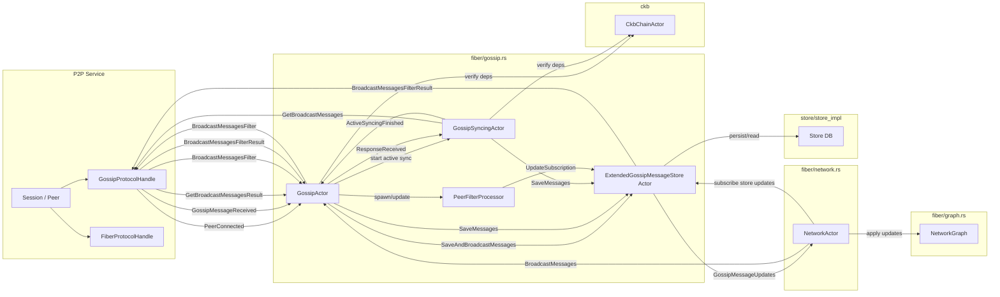

# Gossip in Fiber: Architecture, Data Flow, and Operational Notes

This note documents the **Fiber** gossip subsystem from an engineering perspective.

## 1. What Gossip Solves

Fiber nodes need a shared(ish) view of the network to do routing and validation:

- **Node information** (identity, addresses, feature bits).
- **Public channels** (existence of an edge between two nodes).
- **Channel state updates** (fee policy, HTLC constraints, enabled/disabled, direction).

In a decentralized network:

- Each node connects to only a small subset of peers.
- Peers can disconnect, partitions happen, nodes restart.
- Peers can be malicious (spam, eclipse-style isolation).

So gossip must provide:

- **Catch-up (history sync)** after downtime or partitions.
- **Incremental updates (subscription)** once caught up.
- **Verification and dependency handling** so “received” does not automatically mean “accepted/applied”.
- **Resource bounds** (rate limiting, peer targeting) for safety and scalability.

---

## 2. Key Concepts in Fiber

### 2.1 Broadcast messages and the Cursor

Fiber treats gossip as an **ordered stream** of broadcast messages.

- Messages are stored with a monotonic ordering key called a **Cursor**.
- Conceptually: `Cursor = (timestamp, message_id)`.

This enables a clean primitive:

- “Give me messages **after** cursor X, up to N items.”

This is implemented by the `GossipMessageStore` trait in `gossip.rs`, backed by the DB store.

### 2.2 Two sync modes: active vs passive

Fiber tracks per-peer sync state via `PeerSyncStatus` (in `gossip.rs`).

- **Active syncing (pull history)**
	- State: `ActiveGet(...)`
	- Mechanism: repeatedly send `GetBroadcastMessages(after_cursor, count)` and advance the cursor.
	- Completion: when the peer returns an empty batch, the peer is considered “caught up”.

- **Passive syncing (subscribe/push updates)**
	- State: `PassiveFilter(cursor)`
	- Mechanism: send `BroadcastMessagesFilter(after_cursor)` so the peer pushes updates.
	- Goal: reduce silos and keep the node up-to-date without constant pulling.

These are not competing modes; they are typically used in phases:

1) Active sync with a limited number of peers to catch up.
2) Passive subscriptions to keep up continuously.

---

## 3. Architecture: Main Components

### 3.1 Actors and responsibilities

Fiber splits the gossip subsystem into a few cooperating actors:

- `GossipActor` (control plane)
	- Tracks connected peers and their `PeerSyncStatus`.
	- Decides which peers to actively sync vs passively subscribe.
	- Routes incoming protocol messages to the right internal component.
	- Triggers periodic maintenance (network tick, pruning stale messages).

- `GossipSyncingActor` (data plane for active syncing)
	- Dedicated per-peer worker for **pulling history**.
	- Sends `GetBroadcastMessages` and processes `GetBroadcastMessagesResult`.
	- On completion, notifies `GossipActor`.

- `PeerFilterProcessor` (subscription management)
	- Manages subscription filters for peers.
	- Updates the store subscription cursor when a peer changes `after_cursor`.

- `ExtendedGossipMessageStore` (store actor + fan-out)
	- Receives batches of messages from `GossipActor` and saves them.
	- Performs dependency/ordering handling (important for correctness).
	- Fans out `GossipMessageUpdates` to subscribers.

### 3.2 Where NetworkGraph fits

`NetworkActor` subscribes to gossip store updates and applies them into `NetworkGraph`.
This is the primary pipeline that turns “gossip messages” into “routing graph state”.

---

## 4. Relationship Diagram (Network + Gossip + Store)

---

## 5. Primary Data Flows

### 5.1 Local broadcast (originating messages)

When Fiber produces a local broadcast message (e.g., node announcement or public channel messages),
`NetworkActor` sends it into gossip via `GossipActorMessage::TryBroadcastMessages(...)`.

`GossipActor` passes these to `ExtendedGossipMessageStore` (save + fan-out) and to peers.

### 5.2 Active syncing (pull history)

Active syncing is driven by `GossipSyncingActor`:

1) Start with a cursor.
2) Send `GetBroadcastMessages(after_cursor)`.
3) Receive `GetBroadcastMessagesResult(messages)`.
4) Save messages into store, advance cursor.
5) Repeat until empty result.

### 5.3 Passive syncing (subscribe/push)

Passive syncing is filter-based:

1) Send `BroadcastMessagesFilter(after_cursor)` to a peer.
2) The peer responds over time with `BroadcastMessagesFilterResult(messages)`.
3) Save messages into store.

This is how a node stays updated after catching up.

---

## 6. Notes and Pitfalls

### 6.1 “Received” does not mean “Applied”

The observable pipeline is:

1) Protocol receives a gossip message.
2) `GossipActor` routes it.
3) Store verifies / checks dependencies / persists.
4) Subscribers receive `GossipMessageUpdates`.
5) `NetworkGraph` applies updates.

If any step drops or delays a message, you can see logs like “received X” without seeing the graph change.

### 6.2 Immutable vs mutable messages

Some messages are effectively immutable and may be broadcast only once (e.g., channel announcements).
If your sync strategy starts from a cursor that is too new, you can miss these older-but-still-relevant
messages permanently.

By contrast, node announcements or channel updates tend to refresh over time, so missing one update is
often healed by later updates.

### 6.3 Cursor selection and “safe” cursors

Fiber uses the concept of a “safe cursor” to avoid syncing from genesis forever. This is practical,
but it must be chosen carefully:

- Too old → bandwidth waste.
- Too new → can miss important older messages.

This trade-off becomes visible when bridging two previously disconnected clusters.

### 6.4 Dependency and ordering

Channel-related updates can depend on:

- Having a channel announcement present.
- Having chain/onchain info available.
- Satisfying timestamp and signature constraints.

A robust store layer typically needs to handle out-of-order arrival and cache/resolve dependencies.

### 6.5 Eclipse-resistance considerations

Fiber distinguishes targeted **outbound** passive syncing peers to reduce eclipse risk. Practical
notes:

- Prefer maintaining subscriptions with multiple independent outbound peers.
- Limit concurrent active syncing peers to bound bandwidth and CPU.

---

## 7. References (code)

- Gossip protocol + actors: `crates/fiber-lib/src/fiber/gossip.rs`
- Network startup + subscription wiring: `crates/fiber-lib/src/fiber/network.rs`
- Persistent storage for broadcast messages: `crates/fiber-lib/src/store/store_impl/mod.rs`
- Graph application of gossip updates: `crates/fiber-lib/src/fiber/graph.rs`

