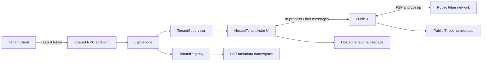
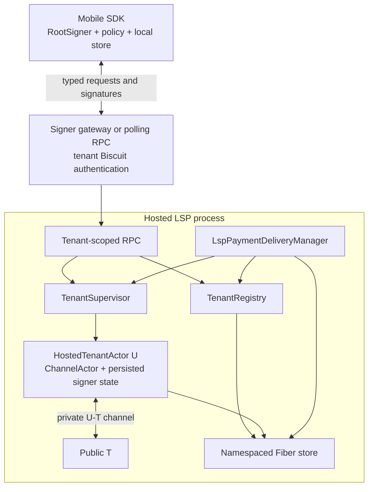
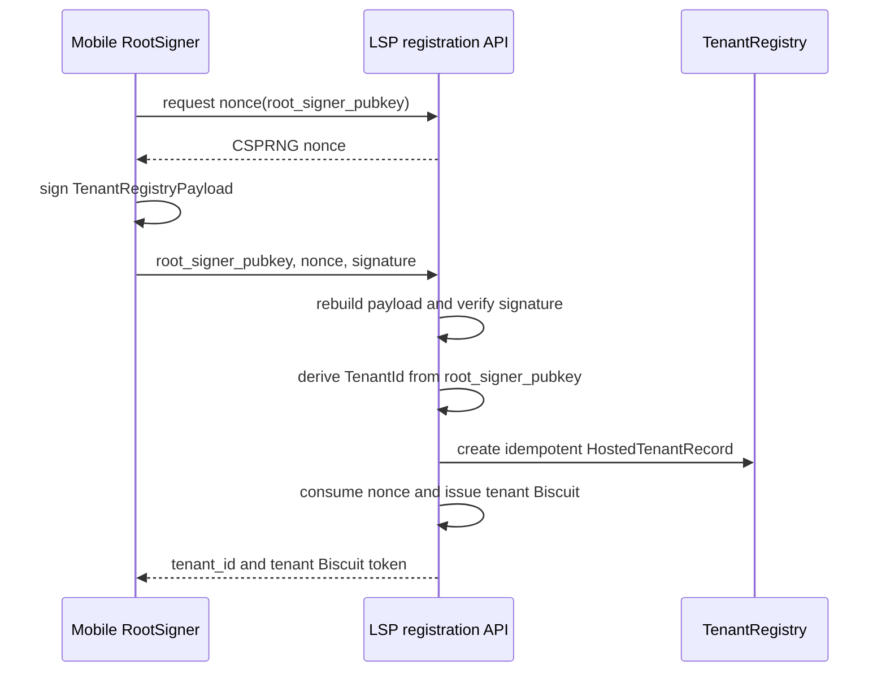
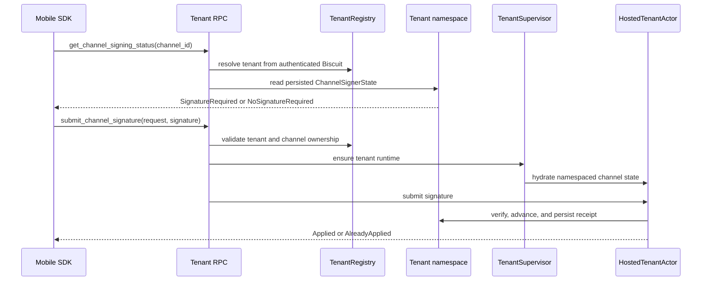

# Hosted LSP remote signer integration

Status: discussion draft

This note describes how to integrate the remote channel signer prototype with
the hosted, multi-tenant LSP implementation. It records the current
architecture, proposes integration boundaries, and identifies decisions that
must be resolved before the combined system can be described as a
non-custodial mobile LSP.

The hosted LSP implementation and the remote signer prototype were developed
on separate branches from a common Fiber baseline. Both are substantial
changes to channel state, actor routing, RPC dispatch, and storage. The
integration should therefore preserve the hosted LSP actor and namespace model
and port the signer state machines into it deliberately. A textual merge of the
two branches is not an architecture.

## Goals

- Keep Public T as the only public Fiber node and gossip participant.
- Keep every hosted tenant in an isolated `NodeNamespace`.
- Move tenant channel keys, MuSig2 secret nonces, and applicable on-chain keys
  out of the hosted process.
- Allow a tenant-scoped client to open and operate a private U-T channel with
  signer-owned public material.
- Persist every channel signing interruption so a tenant runtime can stop and
  later resume safely.
- Derive tenant identity from the mobile `RootSigner` identity public key and
  require proof of that key only during tenant registration.
- Bind later signer operations to the tenant through its issued Biscuit token,
  without trusting tenant or namespace identifiers supplied in a request body.
- Prevent a hosted delivery from leaving `Deferred` until the tenant channel
  can make signing progress.
- Preserve existing Fiber peer messages and channel semantics.

## Non-goals of the first integration slice

- A production mobile transport, push notification service, or multi-device
  protocol.
- Multi-node tenants or tenant migration between LSP processes.
- A complete phone-side balance and TLC policy engine.
- Final invoice authorization and preimage custody semantics.
- A claim that the current permissive nonce-reuse compatibility mode is safe
  for production.
- Offline pre-signing for every watchtower or justice path.

## Current hosted LSP baseline

The hosted LSP currently runs one public trampoline node and a bounded set of
tenant Fiber runtimes:



`TenantRegistry` owns durable tenant identity and the U-T private-channel
binding. `TenantSupervisor` owns only live runtime instances. An authenticated
tenant RPC asks `LspService` for a tenant RPC context; the service hydrates the
tenant when required and returns the tenant actor, configuration, and
namespaced store.

The current implementation generates the tenant Fiber private key under the
LSP tenant directory. That key supplies both the tenant protocol identity and
the existing in-process channel/invoice signing behavior. This is intentionally
custodial and is the boundary the remote signer integration changes.

## Remote signer prototype baseline

The signer prototype provides two related but separate mechanisms:

1. a runtime-independent signer core that owns channel key derivation, secret
   nonces, signing-safety state, and typed signing;
2. persistent Node-side channel and watchtower signer state machines that pause
   on a typed request and resume after an idempotent signature submission.

For a channel using deferred external signing, the Node persists:

```text
External / Ready
    -> AwaitingSignature(request_id, revision, typed_content)
    -> Ready
```

The client calls `get_channel_signing_status`, recomputes and reviews the typed
signing content through `fiber-lsp-sdk`, and calls
`submit_channel_signature`. A repeated identical submission returns
`AlreadyApplied`; a conflicting result is rejected.

The prototype proves that channel keys and signing can cross an asynchronous
boundary. It does not yet implement the hosted tenant registry, tenant
namespaces, a durable mobile mailbox, signer sessions, or delivery readiness.

## Target architecture

The target separates four identities that must not be collapsed:

| Identity | Purpose | Authority |
| --- | --- | --- |
| RootSigner identity public key | Stable mobile signer identity and tenant registration proof | Mobile signer |
| `tenant_id` | Deterministic account, authorization, quota, and namespace identifier derived from the RootSigner public key | LSP control plane |
| `tenant_pubkey` | Fiber protocol identity of hosted U | Hosted tenant runtime |
| `channel_id` | One Fiber channel state machine | Fiber protocol |

`tenant_id` is not supplied by an operator and is not a Fiber wire identity.
It is derived canonically from the RootSigner identity public key.
`tenant_pubkey` is the separate, server-hosted Fiber protocol identity.
`channel_id` is not an authorization principal. The signer SDK may keep a local
`(LSP endpoint, tenant_id, channel_id) -> ChannelKeyId` mapping, but the LSP
does not need to know or validate the local `ChannelKeyId`.



The gateway is a service-level component. It must remain available when a
tenant runtime is cold. Evicting `HostedTenantActor U` must not invalidate the
tenant credential, close a mobile signer session, or lose a pending request.

### SDK ownership

The remote signer is part of `fiber-lsp-sdk`; it is not a standalone
`fiber-signer` crate. The SDK owns the complete client-side LSP workflow:

```text
fiber-lsp-sdk
  signer
    RootKey / RootSigner
    channel signer and ChannelKeyId
    signer storage abstraction
  tenant
    TenantRegistryPayload signing
    nonce, registration, and Biscuit lifecycle
  rpc
    hosted-LSP RPC client and wire conversion
  channel
    signing-status polling, typed review, and signature submission
```

The signer and storage layers must remain runtime-independent and usable on
native and WASM targets. Transport and scheduling are adapters above those
layers so applications can select their own HTTP client, persistence backend,
and polling or wake-up mechanism.

The Node must not depend on `fiber-lsp-sdk`. Shared canonical payloads, tenant
ID derivation, public signer material, and signer RPC wire types belong in
`fiber-types` (and `fiber-json-types` where JSON conversion is required). The
Node owns durable channel/watchtower signer state machines, signature
verification, namespace authorization, and actor continuation. It never owns
SDK channel secrets.

## Key custody

The first integrated architecture uses four distinct key domains:

| Key domain | Initial owner | Notes |
| --- | --- | --- |
| RootSigner identity key | Mobile signer | Derives `tenant_id` and signs only the tenant registration payload |
| tenant Fiber node identity | Hosted LSP | Required by the current runtime and invoice model |
| channel funding, TLC, commitment, and MuSig2 nonce keys | Mobile signer | Must never fall back to the Node's local signer |
| CKB funding wallet key | Wallet or configured funding service | Independent from channel signing |

Keeping the tenant node key at the LSP preserves the current hosted runtime and
invoice behavior, but it does not by itself prove user authorization. Invoice
authorization and preimage release require a later signer policy decision.

## Integration boundaries

### Channel actor

The signer state belongs beside, not inside, the Fiber channel lifecycle:

```text
ChannelActorData
  protocol state: ChannelState
  signer state:   Internal | External(Ready | AwaitingSignature)
```

An external channel must persist public signer material and the complete typed
request required to resume a paused transition. It must not persist channel
private keys or silently fall back to the local `InMemorySigner`.

The remote signer logic must be ported into the hosted branch's
`FiberActorCore` and `FiberActorCommand` model. Hosted actors accept the
restricted Fiber mailbox; signer integration must not reintroduce unrestricted
`NetworkActorMessage` routing into a tenant runtime.

### RPC dispatch

The following RPCs must be tenant-aware:

- `open_channel_with_external_funding`
- `submit_signed_funding_tx`
- `get_channel_signing_status`
- `submit_channel_signature`
- `get_watchtower_signing_status`
- `submit_watchtower_signature`

Tenant identity comes exclusively from the authenticated request extension.
The server then resolves a namespaced store and verifies that the channel is in
that namespace.

Read and mutation paths have different runtime requirements:

- signing-status queries should read the tenant namespace while the runtime is
  cold;
- signature submission should persist or validate the submission, hydrate the
  tenant if needed, resume the channel actor, and return only after the result
  is `Applied` or known to be `AlreadyApplied`;
- ordinary channel operations may continue to require an active runtime.

The existing `GetTenantRpcContext` always hydrates a runtime, so the integration
should introduce a store-only tenant context rather than using runtime
activation for read-only signer polling.

### Store and migrations

The hosted branch already adds an invoice trampoline-hint migration and store
namespaces. The signer branch adds channel and watchtower signer-state
migrations. The combined migration chain must preserve this order:

1. existing upstream migrations;
2. hosted invoice/trampoline migration;
3. channel signer-state migration;
4. watchtower signer-state migration.

Schema fingerprints must be regenerated from the combined data types. The
`.schema.json` file from either source branch is incomplete for the integrated
tree.

## Tenant Registry integration

### Current and target records

The current registry persists one record per tenant:

```rust
struct HostedTenantRecord {
    tenant_id: TenantId,
    tenant_pubkey: Pubkey,
    private_channel_id: Option<Hash256>,
    created_at: u64,
}
```

The integration adds the RootSigner identity public key:

```rust
struct HostedTenantRecord {
    tenant_id: TenantId,
    root_signer_pubkey: Pubkey,
    tenant_pubkey: Pubkey,
    private_channel_id: Option<Hash256>,
    created_at: u64,
}
```

The target record answers four questions:

1. Does the tenant exist?
2. Which RootSigner identity deterministically owns it?
3. Which Fiber protocol identity belongs to it?
4. Which private U-T channel is its hosted channel?

Runtime liveness is deliberately absent and remains owned by
`TenantSupervisor`.

The current persistence interface provides only `get`, `put`, and `list` for
tenant records. Registration enforces `tenant_pubkey` uniqueness by scanning
the tenant list. `bind_private_channel` prevents one tenant from being rebound
to a different channel, but there is no durable reverse channel index, no
cross-tenant channel uniqueness check, and no compare-and-swap or batch
boundary covering a record and its indexes. These are current implementation
constraints, not properties to preserve.

### Decided identity model

One RootSigner identity key corresponds to one hosted tenant:

```text
RootSigner identity public key
    -> canonical tenant-id derivation
    -> TenantId
    -> HostedTenantRecord and NodeNamespace
```

`TenantId` is the lowercase hexadecimal encoding of a 32-byte, domain-separated
Blake2b digest:

```text
TenantId = hex(blake2b_256(
    "fiber-hosted-lsp-tenant-id/v1" ||
    compressed_root_signer_pubkey
))
```

The same RootSigner backup therefore restores the same `tenant_id`; a newly
generated RootSigner creates a different tenant. The client does not choose or
submit a `tenant_id` during registration. The server derives it from the
verified public key through one canonical implementation, for example
`TenantId::from_root_signer_pubkey`.

The complete RootSigner identity public key remains in `HostedTenantRecord` so
the record can be checked against its derived ID and used to verify a future
registration or session proof. It is distinct from the server-owned
`tenant_pubkey` used by the Fiber protocol runtime.

This one-to-one model deliberately omits a separate `SignerRegistry`. Root key
rotation while preserving the same tenant, multiple authorized RootSigners,
and recovery without the original RootSigner backup are outside the MVP and
would require a future authorization or recovery registry.

### Tenant registration proof

Only tenant registration requires a RootSigner identity signature. The
canonical signed value is named `TenantRegistryPayload`:

```yaml
protocol: "fiber-hosted-lsp-tenant-registry/v1"
lsp_node_id: <Public T node id>
root_signer_pubkey: <RootSigner identity public key>
nonce: <32 random bytes issued by the LSP>
```

`TenantRegistryPayload` has a canonical binary encoding. The YAML above
documents its fields; it is not the signing serialization.

The LSP generates `nonce` with a cryptographically secure random number
generator. It is not derived from a timestamp, tenant ID, public key, or client
input. At most one nonce is current for a given RootSigner public key. Issuing a
new nonce invalidates the previous one, and successful registration consumes
it.

The MVP payload has no `expires_at`. The server may garbage-collect unused
pending nonces as an operational policy, but time is not part of signature
verification. A consumed nonce cannot be reused to register again or mint
additional credentials.

The registration flow is:



Tenant creation and nonce consumption require an atomic or idempotently
recoverable boundary. Replaying the same proof must not create another tenant
or repeatedly issue new tokens. Lost registration responses are recovered
through a separate authentication/token issuance flow rather than by treating
the registration proof as a permanent login credential.

### Target invariants

- `tenant_id` is deterministically derived from `root_signer_pubkey`.
- A RootSigner identity public key maps to exactly one tenant record.
- A `tenant_pubkey` belongs to at most one active tenant record.
- A private U-T `channel_id` belongs to at most one tenant record.
- Registry lookup never trusts a tenant ID or namespace from an unauthenticated
  request body.
- Runtime status, session liveness, and current signer request are not fields of
  the tenant record.
- Registry records contain public metadata and locators only, never signer
  secrets.

### Channel ownership and signer binding

Channel ownership should continue to come from the tenant namespace and the
registry's private-channel binding. The Node does not persist the signer's
local `ChannelKeyId`.

The LSP does not require a derivation proof or an additional RootSigner
signature over `ChannelOpenSignerMaterial`. Possession of the tenant Biscuit
token authorizes the caller to submit channel public material into that
tenant's namespace. Channel cryptographic validity is then enforced by parsing
the public material, verifying subsequent partial signatures, and applying the
normal channel state machine.

The channel state itself records whether it is `Internal` or `External`, the
public signer material, revision, pending request, and idempotency receipt. A
signer submission is accepted only when all of the following hold:

1. the authenticated token resolves to `tenant_id`;
2. the channel exists in that tenant's namespace;
3. the channel is external-signer controlled;
4. request ID, channel revision, signature, and next public material match the
   persisted request.

The Biscuit token is a bearer credential: it proves possession of the
credential issued after RootSigner-authenticated registration, not that the
RootSigner signed every later RPC. This is the selected MVP authorization
model.

### Registry operations that need atomicity

- Initial tenant creation, nonce consumption, and reverse
  `root_signer_pubkey -> tenant_id` and `tenant_pubkey -> tenant_id` indexes.
- Binding a private channel and reverse `channel_id -> tenant_id` index.
- Removing or disabling a tenant only after deliveries, channels, signing
  requests, and on-chain recovery work are terminal.

These operations should use one namespaced batch or compare-and-swap boundary.
Actor serialization alone is insufficient for restart recovery.

## Signer and tenant state synchronization

### State domains

The combined system has independent durable and live state:

| State | Owner | Durable |
| --- | --- | --- |
| tenant identity and private-channel binding | `TenantRegistry` | yes |
| tenant channel/payment/invoice state | tenant `NodeNamespace` | yes |
| channel signing request and revision | `ChannelActorData` | yes |
| mailbox requests, responses, and cursor | signer gateway | yes in production |
| tenant runtime liveness | `TenantSupervisor` | no |
| signer session connectivity | signer gateway | no |
| hosted delivery state | `LspPaymentDeliveryManager` | yes |

No single `online` boolean can summarize these states.

### Readiness

The current hosted LSP treats the private channel being online as sufficient to
dispatch a buffered delivery. With an external signer, readiness becomes:

```text
TenantSignReady =
    tenant runtime is active
    AND private U-T channel is ready
    AND an authenticated tenant signer session is Ready
    AND channel state roots/counters are synchronized
    AND there is no conflicting unresolved signing request
```

Until a production signer session exists, an external-signer tenant should not
automatically consume a buffered delivery merely because its channel is online.
The polling prototype may require explicit interactive activation.

### Cold query and signature submission



A crash between receiving a response and applying it must not lose the response
or cause a different signature to be accepted for the same request. The polling
MVP can rely on the persisted channel request plus `last_applied`. A mobile
gateway additionally needs a durable mailbox response record so hydration
failure does not discard a response already accepted from the device.

### Hosted receive synchronization

The delivery manager must check signer readiness before
`Deferred -> Dispatching`. Once a delivery is `InFlight`, the hosted buffer
deadline no longer owns its lifetime; allowing an offline signer to block at
that point can hold the downstream payment until TLC expiry.

The safe order is:

1. persist the hosted delivery as `Deferred`;
2. authenticate or wake the signer and synchronize its channel view;
3. hydrate the tenant runtime;
4. confirm the private channel and signer are ready;
5. persist `Dispatching`;
6. create the downstream payment;
7. process typed signer requests during channel commitment;
8. persist the downstream outcome before settling the upstream TLC.

If readiness is lost before step 5, remain `Deferred`. If it is lost after step
6, normal TLC deadlines and the payment state machine own recovery; the system
must not create a second downstream payment.

### Eviction

A tenant runtime may be evicted only when it has no:

- in-flight payment or active TLC;
- pending channel operation;
- unapplied channel signature response;
- non-terminal hosted delivery;
- pending on-chain signing operation that requires the runtime.

An outstanding request may survive runtime eviction only when all continuation
data is durable and the signer gateway remains available independently.

## Implementation sequence and test gates

No phase is complete without its paired tests. Tests are implemented in the
same change as the behavior they cover; a later end-to-end test does not
replace unit tests for cryptographic encodings, state transitions, namespace
checks, or crash recovery.

| Phase | Implementation | Required test gate |
| --- | --- | --- |
| 1. Shared types and SDK signer core | Add `fiber-lsp-sdk`; move and adapt the prototype signer core; add canonical `TenantRegistryPayload` encoding and TenantId derivation to shared types | Fixed payload/digest and TenantId vectors; RootSigner create/open/restore; channel-key isolation; signer-store persistence; native tests and relevant WASM compile checks |
| 2. Tenant registration | Add nonce storage and registration RPCs; verify the RootSigner proof; derive TenantId server-side; issue the tenant Biscuit; persist `root_signer_pubkey` | Nonce replacement, consumption, and replay rejection; wrong signature, public key, nonce, and LSP node rejection; derived TenantId cannot be client-controlled; persistence/restart test; nonce-to-registration RPC integration test |
| 3. Channel signer state | Port the deferred external `ChannelActor` signer state machine into `FiberActorCore`; combine migrations; retain the internal signer path | Request/revision transition tests; wrong request, revision, signature, and next material rejection; `AlreadyApplied` idempotency; migration defaults existing channels to `Internal`; existing internal-signer regression tests |
| 4. Tenant-scoped signer RPC | Add cold store-only status reads and hydrated signature submission; enforce namespace and private-channel ownership | Tenant A cannot query or submit for Tenant B; cold status query; submission hydrates and resumes the tenant; pending request survives restart |
| 5. Hosted U-T external signer E2E | Connect SDK registration, Biscuit RPC client, external channel open, polling/signing loop, and payment flow | Registration through channel readiness; outbound and inbound payment; runtime eviction/rehydration; Node and SDK restart; repeated submission remains idempotent |
| 6. Gateway and readiness | Add durable mailbox/cursors, signer sessions and fencing; gate delivery on `TenantSignReady` | Disconnect/reconnect and old-session fencing; mailbox recovery and cursor tests; delivery remains `Deferred` while signer is not ready; no duplicate downstream dispatch |
| 7. Remaining signer policy | Integrate watchtower signing; define invoice authorization, preimage release, and strict nonce behavior | Watchtower recovery E2E; invoice/preimage policy tests; nonce reuse fails closed; restart and on-chain recovery tests |

Each phase also runs formatting and targeted clippy checks. A change to shared
types or persistence additionally runs the applicable native/WASM checks,
migration-schema checks, and generated RPC documentation checks before the
phase is accepted.

The signer prototype is ported selectively. Its standalone crate boundary and
its older network-actor integration are not merged wholesale: client-side code
moves into `fiber-lsp-sdk`, while Node-side state machines are adapted to the
hosted branch's restricted `FiberActorCommand` and `FiberActorCore` model.

## Open Tenant Registry decisions

The identity and registration model is decided. The remaining registry
questions are:

1. Does tenant node-key rotation preserve the same tenant namespace, and how
   are existing U-T channels closed or recovered?
2. Should `private_channel_id` remain in `HostedTenantRecord`, or become a
   separate channel-binding registry if multiple private channels are later
   supported?
3. Which authentication flow reissues or rotates a tenant Biscuit token without
   reusing the one-time registration proof?
4. What terminal-state checks are required before disabling or deleting a
   tenant, and is deletion ever preferable to an immutable disabled record?
5. Should pending registration nonces be persisted across LSP restart, or may
   restart invalidate all outstanding registration attempts?

## Security boundary

This integration can remove channel and selected on-chain private keys from the
LSP process. It does not automatically remove trust in the LSP for node
identity, invoice construction, routing availability, or denial of service.

Furthermore, the current signer prototype records nonce-reuse conflicts as
warnings for compatibility with the existing Fiber signing lifecycle. That
mode is useful for validating the abstraction boundary but must not be treated
as a deployable remote signer policy. Strict nonce behavior, state-root
verification, invoice authorization, and preimage policy remain release
blockers for a non-custodial product.
