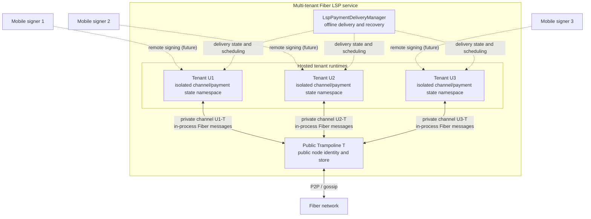

# Hosted LSP and multi-tenant trampoline delivery

This note describes the first implementation of a hosted Lightning Service
Provider (LSP) in Fiber. It focuses on trampoline routing and receiving payments
for mobile tenants that may be offline.

The proposed remote channel signer architecture and its integration with tenant
identity, storage, runtime readiness, and payment delivery are described in
[Hosted LSP remote signer integration](hosted-lsp-remote-signer.md).

## Scope

One Fiber process hosts:

- one public trampoline node, Public T, which participates in the public Fiber
  network;
- multiple hosted tenant state domains, U1, U2, and so on, each with isolated
  channel/payment state, an invoice/channel signing key, and a `NodeNamespace`
  in the shared Fiber store;
- one LSP payment delivery manager, which persists and resumes incoming hosted
  payments.

Public T is the only public, gossip-routable node identity. Each tenant keeps
the cryptographic key required by the existing invoice and channel state
machines, but that key is not announced as another network node. A private
channel connects each tenant directly to Public T. The existing Fiber channel
messages and state transitions remain unchanged; messages on these co-located
channels are delivered directly between actors, without Tentacle encoding,
socket I/O, peer discovery, or gossip synchronization. A shared tenant message
dispatcher resolves the runtime by `(tenant_id, channel_id)`; the tenant's
invoice/channel key remains an internal protocol key rather than a public peer
endpoint.



The remote channel signer shown above is the target deployment architecture,
not part of this implementation stage. For now, the hosted process owns each
tenant's invoice/channel signing key. A production deployment that requires
non-custodial keys must add the remote signer wire protocol before treating
this boundary as non-custodial.

## Invoice registration and payer hint

When a tenant token calls the standard `new_invoice` RPC, the hosted runtime
creates a normal finite-expiry Fiber invoice, signs it with the tenant invoice
key, and embeds Public T in the signed trampoline route hint. Before the RPC
returns, the LSP also registers the invoice payment hash and creates an internal
signed `LspInvoiceHint` delivery-policy record. The record binds:

- Public T's public trampoline identity;
- payment hash;
- a digest of the complete signed invoice, including amount, asset and terms;
- requested buffer duration and absolute invoice expiry.

The default requested buffer duration is 24 hours and the protocol maximum is
seven days. An operator may configure a shorter service-wide cap; the signed
hint records the duration actually accepted by the service. The actual deadline
is still bounded by invoice and TLC expiry, so these values do not promise that
every payment can wait that long. The `LspInvoiceHint` record is intentionally
not embedded in the invoice encoding or trampoline onion payload. A payer only
needs the tenant-signed invoice and uses its trampoline route hint to select
Public T. Public T resolves the tenant, delivery policy, and private channel
from its durable invoice registry; no tenant node id is exposed to the payer.

An invoice without a registered hint keeps existing Fiber behavior: Public T
forwards it immediately as an ordinary trampoline payment. Absence of a hint is
not a request to fail or buffer the payment.

## Hosted receive flow

1. The payer builds a normal route to Public T. It does not need to know Public
   T's private channel or the path from T to the hosted tenant.
2. Public T decodes the existing trampoline forwarding payload. If the payment
   hash belongs to a registered hosted invoice, it durably creates an LSP
   delivery record and keeps the upstream TLC pending.
3. The delivery manager keeps the delivery `Deferred` while the tenant is cold
   or its U-T private channel is offline. It does not hydrate a cold tenant only
   to wait; the signer/control plane explicitly activates the tenant and
   reconnects its private channel.
4. Once the private channel is online, Public T creates the normal downstream
   payment session and sends the TLC to U through the existing trampoline
   forwarding path. Channel protocol messages cross an in-process actor route,
   while retaining their existing wire-level structures and semantics. If the
   trampoline request permits multiple parts, Public T may split this one
   upstream TLC over multiple downstream routes with the existing payment MPP
   implementation.
5. Success or failure settles the upstream TLC through the existing payment
   session and trampoline settlement logic.

`upstream TLC pending` therefore means that a payer-to-Public-T incoming TLC is
accepted but not removed yet while the LSP waits to deliver an incoming payment
to an offline hosted receiver. It is not LSP-assisted outbound payment.

## Buffer deadline and durable state

The deadline for a delivery that has not yet been dispatched is:

```text
min(
  accepted_at + hint.buffer_duration,
  invoice.expires_at,
  max_outgoing_tlc_expiry - tlc_expiry_delta - 30 seconds
)
```

The last term preserves enough expiry budget to fail safely upstream. The
delivery state machine is persisted in the shared Fiber store:

```text
Deferred -> Dispatching -> InFlight -> SettlingUpstream -> Succeeded | Failed
    |              |                         ^
    +--------------+-------------------------+
          buffer timeout or permanent failure
```

The buffer deadline applies only to `Deferred` and `Dispatching`. Once the
downstream payment is `InFlight`, the existing TLC expiries and payment session
own its lifetime; the LSP buffer timer must not cancel it. The final downstream
outcome and success preimage are persisted before `SettlingUpstream` resolves
the payer-to-Public-T TLC. On process restart,
the LSP reloads non-final deliveries, first verifies that the exact upstream
channel/TLC/payment-hash tuple is still pending, restores the trampoline resource
reservation, consults the public payment session, and resumes or finalizes the
record idempotently. If the upstream TLC was already removed before downstream
dispatch, the delivery becomes `Failed` and its reservation is released;
the LSP does not create a downstream payment or attempt another upstream
failure. A transient downstream dispatch or final payment failure (for example,
no route or an offline peer) returns to
`Deferred` and is retried until the deadline instead of immediately failing the
upstream TLC. Each transition into `Dispatching` durably increments
`attempt_count`, while `last_error` records the most recent dispatch or payment
failure for RPC inspection. A permanent dispatch failure instead enters
`SettlingUpstream` immediately and fails the upstream TLC with its structured
TLC error code; it is never returned to `Deferred`. Permanent outcomes reported
by the downstream payment actor, including an expired or cancelled invoice and
final amount/expiry mismatches, follow the same settlement path. Deadline
processing records `SettlingUpstream(Failed)` before failing the upstream TLC,
then records `Failed`; a restart between those operations resumes the same
settlement.

Each durable delivery is keyed by `(incoming_channel_id, incoming_tlc_id)`, the
identity of the concrete payer-to-Public-T TLC being held. Replaying the same
TLC is idempotent, while another TLC with the same `payment_hash` is a distinct
execution record. `payment_hash` remains a secondary index for invoice lookup,
PaymentActor outcome callbacks, and the payment-delivery RPC. The RPC returns
the active execution when one exists, otherwise the most recently updated final
execution. A successfully delivered payment hash cannot be accepted again.

This phase supports downstream MPP: one upstream trampoline TLC may be split by
Public T into multiple downstream payment attempts when `max_parts > 1`. It does
not yet aggregate upstream MPP. Multiple concurrently active incoming TLCs with
the same payment hash are rejected because the existing PaymentActor and its
outcome callbacks identify one payment session by `payment_hash`. Supporting
upstream MPP requires a payment-level aggregation state machine that validates
the total amount and compatible deadlines, records every upstream TLC, and
settles all parts from one downstream outcome.

## Configuration

Enable `fiber`, `ckb`, `rpc`, and `lsp` in `services`. The `lsp` section accepts
an optional boot-time tenant list, a bound on resident tenant runtimes, a buffer
policy cap, and global/per-tenant pending-delivery limits:

```yaml
services:
  - fiber
  - ckb
  - rpc
  - lsp

lsp:
  max_active_tenants: 64
  max_buffer_duration_ms: 604800000 # 7 days
  max_pending_deliveries: 1024
  max_pending_deliveries_per_tenant: 64
  tenants:
    - u1
    - u2
```

The default storage layout is:

```text
$BASE_DIR/fiber/store       Public T root keyspace, LSP metadata, and tenant namespaces
$BASE_DIR/lsp/tenants/<id>  isolated tenant signing keys and runtime-local files
```

LSP metadata uses `NodeNamespace::lsp_metadata()` and each hosted tenant uses a
`NodeNamespace::hosted_tenant(tenant_id)` key prefix in the already-open Fiber
store. Tenant identifiers are restricted to 1-64 ASCII letters, digits,
hyphens, or underscores. All direct writes, atomic batches, and prefix scans are
translated at the Store boundary, so the same channel id or payment hash cannot
alias another tenant.

## RPC administration

The `lsp` RPC module is mounted only when the LSP service is running. Its
methods are:

- `lsp_get_status`
- `lsp_register_tenant`, `lsp_ensure_tenant`, `lsp_evict_tenant`, and
  `lsp_list_tenants`
- `lsp_new_invoice`, `lsp_get_invoice`, `lsp_send_payment`, and
  `lsp_get_payment`
- `lsp_get_payment_delivery`

With Biscuit authentication enabled, reads require `read("lsp")` and mutations
require `write("lsp")`. These are operator/SDK APIs and should not be exposed to
untrusted clients without authentication.

Hosted tenant data-plane requests reuse the standard Fiber RPC method names.
The authority block of the Biscuit token contains `tenant("<tenant_id>")` plus
the normal resource capabilities such as `write("channels")`,
`write("payments")`, or `read("invoices")`. The authentication middleware puts
the verified tenant identity in the request extensions; it is not accepted as a
JSON-RPC parameter. The channel, invoice, and payment RPC handlers then resolve
that tenant's active actor and Store namespace through `TenantSupervisor`.
Tokens without a tenant fact continue to address Public T.

When a tenant token calls the standard `new_invoice` method, the hosted runtime
signs the invoice with the tenant invoice key, adds Public T as its trampoline
route hint, and registers the payment hash with the LSP service before returning
the invoice. Clients do not register hosted invoices separately.

For example, a hosted wallet calls the existing `open_channel` method with
Public T's pubkey, its own `funding_amount`, and `public: false`. A tenant-scoped
request cannot open a public channel or target another peer. `new_invoice`,
`get_invoice`, and the payment RPCs use the same request-scoped routing. The
operator-oriented `lsp_new_invoice` composite remains available for callers
that explicitly select a tenant and buffer duration and need the full
registration record. Hosted clients use the standard `new_invoice` method.

## Current boundaries

- This phase covers hosted receiving through Public T and U-T private channels;
  it does not add LSP-assisted outbound payments.
- Tenant runtime count is bounded, but eviction is explicit rather than an LRU
  policy. Eviction is rejected while that tenant has a non-final hosted
  delivery, an in-flight payment, active TLCs, or pending channel operations.
  A stopped runtime is removed from the active set and rehydrated by the next
  explicit ensure operation.
- Tenant runtimes currently reuse the existing Fiber network coordinator as an
  internal channel/payment dispatcher. They open no P2P listener and perform
  no gossip synchronization. The LSP layer no longer depends directly on that
  full coordinator: `HostedTenantRuntimeMessage` exposes only tenant Fiber
  delivery and activity inspection, with a temporary network-backed adapter
  behind it. A later refactor can replace that adapter with a smaller dedicated
  tenant coordinator without changing the supervisor or in-process transport
  contract. The runtime actor itself is no longer registered directly as an
  in-process peer: a tenant-scoped endpoint observes the unchanged Fiber
  message's channel id and routes it through `TenantMessageDispatcher`.
  Runtime and endpoint registration are single-owner and refuse replacement by
  another live actor.
- Tenant channel opening and funding still use existing Fiber RPC/channel
  workflows.
- Remote Channel Signer transport, authorization, replay protection, and signer
  recovery remain a separate protocol phase.
- Trampoline/LSP metrics are intentionally outside this implementation.
