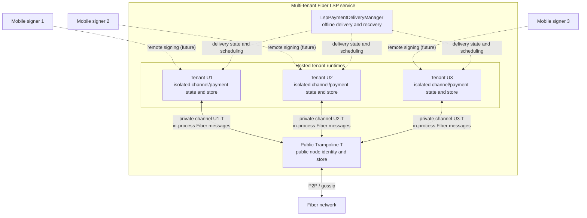

# Hosted LSP and multi-tenant trampoline delivery

This note describes the first implementation of a hosted Lightning Service
Provider (LSP) in Fiber. It focuses on trampoline routing and receiving payments
for mobile tenants that may be offline.

## Scope

One Fiber process hosts:

- one public trampoline node, Public T, which participates in the public Fiber
  network;
- multiple hosted tenant state domains, U1, U2, and so on, each with isolated
  channel/payment state, an invoice/channel signing key, and a database;
- one LSP payment delivery manager, which persists and resumes incoming hosted
  payments.

Public T is the only public, gossip-routable node identity. Each tenant keeps
the cryptographic key required by the existing invoice and channel state
machines, but that key is not announced as another network node. A private
channel connects each tenant directly to Public T. The existing Fiber channel
messages and state transitions remain unchanged; messages on these co-located
channels are delivered directly between actors, without Tentacle encoding,
socket I/O, peer discovery, or gossip synchronization.



The remote channel signer shown above is the target deployment architecture,
not part of this implementation stage. For now, the hosted process owns each
tenant's invoice/channel signing key. A production deployment that requires
non-custodial keys must add the remote signer wire protocol before treating
this boundary as non-custodial.

## Invoice registration and payer hint

The tenant creates and signs a normal finite-expiry Fiber invoice. The LSP
registers that invoice and returns a signed `LspInvoiceHint` sidecar. The hint
binds all of the following under Public T's signature:

- Public T's public trampoline identity;
- payment hash;
- a digest of the complete signed invoice, including amount, asset and terms;
- requested buffer duration and absolute invoice expiry.

The default requested buffer duration is 24 hours and the protocol maximum is
seven days. The actual deadline is still bounded by invoice and TLC expiry, so
these values do not promise that every payment can wait that long. The hint is
intentionally not embedded in the invoice encoding or the trampoline onion
payload. A wallet distributes the invoice and sidecar together, verifies both
signatures, and uses the single trampoline hop in the hint as Public T. The
hint carries no tenant node id; Public T resolves the tenant and private
channel from its durable invoice registry.

An invoice without a registered hint keeps existing Fiber behavior: Public T
forwards it immediately as an ordinary trampoline payment. Absence of a hint is
not a request to fail or buffer the payment.

## Hosted receive flow

1. The payer builds a normal route to Public T. It does not need to know Public
   T's private channel or the path from T to the hosted tenant.
2. Public T decodes the existing trampoline forwarding payload. If the payment
   hash belongs to a registered hosted invoice, it durably creates an LSP
   delivery record and keeps the upstream TLC pending.
3. The delivery manager starts the tenant runtime if it is cold and waits for
   the U-T private channel to become online.
4. Once the private channel is online, Public T creates the normal downstream
   payment session and sends the TLC to U through the existing trampoline
   forwarding path. Channel protocol messages cross an in-process actor route,
   while retaining their existing wire-level structures and semantics.
5. Success or failure settles the upstream TLC through the existing payment
   session and trampoline settlement logic.

`upstream TLC pending` therefore means that a payer-to-Public-T incoming TLC is
accepted but not removed yet while the LSP waits to deliver an incoming payment
to an offline hosted receiver. It is not LSP-assisted outbound payment.

## Buffer deadline and durable state

The deadline for a delivery that has not yet been dispatched is:

```text
min(
  accepted_at + hint.buffer_duration,
  invoice.expires_at,
  max_outgoing_tlc_expiry - tlc_expiry_delta - 30 seconds
)
```

The last term preserves enough expiry budget to fail safely upstream. The
delivery state machine is persisted in the LSP database:

```text
Deferred -> Dispatching -> InFlight -> Succeeded | Failed
```

The buffer deadline applies only to `Deferred` and `Dispatching`. Once the
downstream payment is `InFlight`, the existing TLC expiries and payment session
own its lifetime; the LSP buffer timer must not cancel it. On process restart,
the LSP reloads non-final deliveries, restores the trampoline resource
reservation, consults the public payment session, and resumes or finalizes the
record idempotently.

## Configuration

Enable `fiber`, `ckb`, `rpc`, and `lsp` in `services`. The `lsp` section accepts
an optional boot-time tenant list and a bound on resident tenant runtimes:

```yaml
services:
  - fiber
  - ckb
  - rpc
  - lsp

lsp:
  max_active_tenants: 64
  tenants:
    - u1
    - u2
```

The default storage layout is:

```text
$BASE_DIR/fiber/store       Public T store
$BASE_DIR/lsp/store         LSP registry and delivery store
$BASE_DIR/lsp/tenants/<id>  isolated tenant channel/payment stores and signing keys
```

The process refuses to start if the LSP metadata store aliases Public T's
store. Tenant identifiers are restricted to 1-64 ASCII letters, digits,
hyphens, or underscores.

## RPC administration

The `lsp` RPC module is mounted only when the LSP service is running. Its
methods are:

- `lsp_get_status`
- `lsp_register_tenant`, `lsp_ensure_tenant`, `lsp_evict_tenant`, and
  `lsp_list_tenants`
- `lsp_register_invoice` and `lsp_get_invoice_registration`
- `lsp_get_payment_delivery`

With Biscuit authentication enabled, reads require `read("lsp")` and mutations
require `write("lsp")`. These are operator/SDK APIs and should not be exposed to
untrusted clients without authentication.

## Current boundaries

- This phase covers hosted receiving through Public T and U-T private channels;
  it does not add LSP-assisted outbound payments.
- Tenant runtime count is bounded, but eviction is explicit rather than an LRU
  policy.
- Tenant runtimes currently reuse the existing Fiber network coordinator as an
  internal channel/payment dispatcher. They open no P2P listener and perform
  no gossip synchronization; a later refactor may extract a smaller dedicated
  tenant coordinator without changing the in-process transport contract.
- Tenant channel opening and funding still use existing Fiber RPC/channel
  workflows.
- Remote Channel Signer transport, authorization, replay protection, and signer
  recovery remain a separate protocol phase.
- Trampoline/LSP metrics are intentionally outside this implementation.
