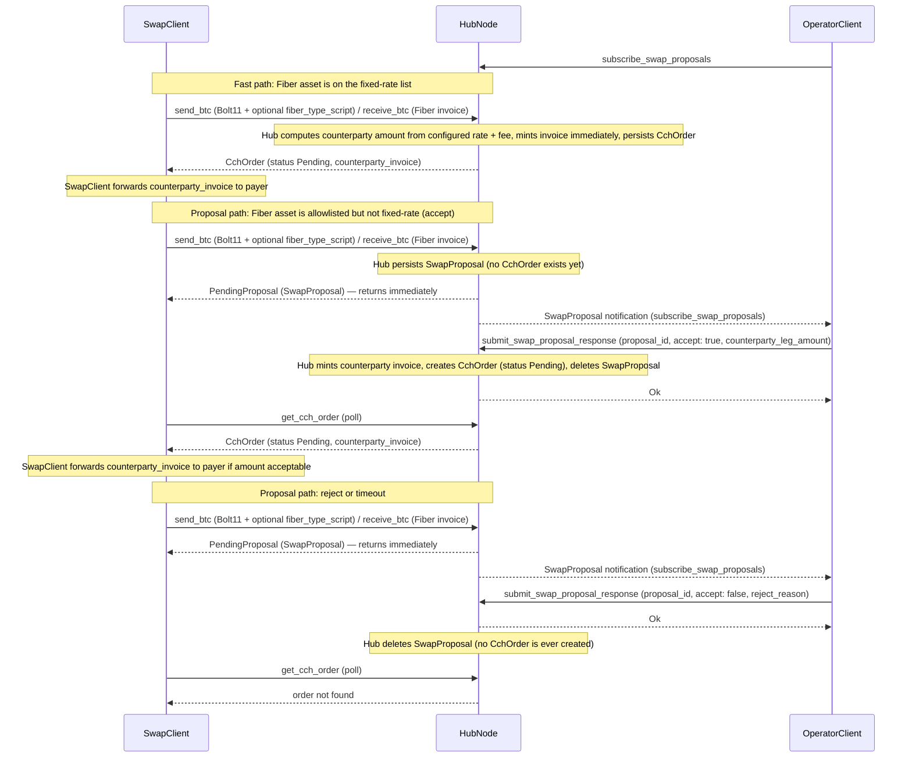

# CCH Multi-Asset Swap

This document specifies cross-chain hub (CCH) behavior for atomic swaps between **Bitcoin on the Lightning Network** and **arbitrary Fiber assets** on CKB payment channels: native CKB or any supported UDT. It builds on the Fiber invoice format ([payment-invoice.md](./payment-invoice.md)) and CCH expiry safety rules ([cch-expiry-dependency.md](./cch-expiry-dependency.md)).

For terminology shared across Fiber docs, see [glossary.md](../glossary.md).

## 1. Scope and assumptions

### What stays the same

- CCH connects a **hub operator** who runs both a Fiber Network Node and a Lightning node (e.g. LND). The hub coordinates HTLCs so that the same **payment hash** locks value on both sides; revealing the preimage on one leg allows settling the other ([HTLC](https://en.wikipedia.org/wiki/Hash_Time-Locked_Contract)-style atomicity).
- The **Lightning leg is BTC-denominated** (amounts on Bolt11 invoices use millisatoshis).
- Interoperability with Lightning requires a **SHA-256** payment hash on the Fiber invoice when that invoice must match LND’s expectations (see [hash algorithm](#33-hash-algorithm) below).

### What changes from single-asset CCH

- Historically, CCH assumed a **single wrapped-BTC UDT** from hub configuration and a **fixed 1:1** mapping between that token’s smallest units and BTC satoshis. Multi-asset mode removes that assumption: the **economic terms of the swap** come from the **invoice the client supplies plus the hub-configured fee** (subject to operator approval where required), not from a hard-coded BTC↔wrapped-BTC parity.
- The CCH RPC flow is now a **proposal → approval → counterparty-invoice issuance** pipeline (see [§5](#5-swap-acceptor-protocol) and [§6](#6-flow-specific-rules-summary)). The swap client submits **one invoice** for the leg they already control. On the **fixed-rate fast path** the hub mints the **counterparty invoice** immediately and returns the order from the same `send_btc` / `receive_btc` call. On the **proposal path** the call does **not** block: the hub persists the **`SwapProposal`** record (a separate store entry; no `CchOrder` exists yet) and returns a `PendingProposal` result immediately; the client polls `get_cch_order` until the counterparty invoice is minted and the order is materialised once the operator resolves the proposal.
- The hub MAY configure a list of **fixed-rate assets** (see [§2.3](#23-fixed-rate-assets-fast-path)). For swaps whose Fiber leg uses a fixed-rate asset, the hub computes the counterparty-leg amount itself, mints the counterparty invoice **immediately**, and **bypasses the operator acceptor**.

### Fiber leg assets (version 1)

| Kind | Invoice identification | Amount unit |
|------|------------------------|-------------|
| **Native CKB** | Amount present; **no** `udt_script` attribute in the invoice data | **Shannons** (1 CKB = 10⁸ shannon), per [payment-invoice.md](./payment-invoice.md) |
| **UDT** | `udt_script` attribute set to the token’s type script | Token **smallest unit** (decimals defined by the token; hub uses metadata—see [§4](#4-hub-policy-allowlisting-and-decimals)) |

Both kinds are first-class. Semantics of encoding and human-readable prefixes follow [payment-invoice.md](./payment-invoice.md).

## 2. Economics

### 2.1 Exchange rate

The **swap rate is not** defined by the hub as a fixed BTC↔asset formula. Rate inputs come from:

- The **swap client**, who submits the invoice for the leg they already control.
- The **hub configuration**, which sets the **fee** (`fee_rate_per_million_sats` + `base_fee_sats`, same as the current implementation).
- For non-fixed-rate assets, the **operator**, who sets the **counterparty-leg amount** the hub will issue, as part of accepting the proposal.
- For fixed-rate assets ([§2.3](#23-fixed-rate-assets-fast-path)), the **hub configuration**, which supplies the rate the hub uses to compute the counterparty-leg amount itself.
- The **swap client** then decides whether to continue the payment (by forwarding the minted counterparty invoice to the payer) based on the resulting amount.

The hub’s job is to:

1. Parse the **submitted invoice** (the leg the client already controls).
2. Apply the **configured fee** (and any per-asset overrides).
3. Enforce **safety checks** (network, expiry, allowlist, hash algorithm, etc.).
4. For non-fixed-rate assets, persist a **`SwapProposal`** record (no `CchOrder` exists yet) and forward that same `SwapProposal` to the operator via the [swap acceptor](#5-swap-acceptor-protocol); the `send_btc` / `receive_btc` call returns a `PendingProposal` result **immediately** (it does not block on the operator). The workflow resumes when the operator submits a response. For fixed-rate assets, skip directly to step 5 using the configured rate.
5. Mint the **counterparty invoice** (with the operator-set or fixed-rate-derived amount). On the fast path this happens inline and the invoice is returned on the same `send_btc` / `receive_btc` call; on the proposal path it happens when the operator accepts, at which point the hub **creates** the `CchOrder` with status `Pending` (the client observes the newly-materialised order by polling `get_cch_order`).
6. Honor payment on the minted counterparty invoice when the user-side payer pays it; if the swap client never forwards it and it expires unpaid, the order terminates as expired.

### 2.2 Hub fees

The fee is **set by the CCH operator via configuration** (same as the current implementation) and expressed on a **BTC-side basis** for comparability across assets:

- `fee_rate_per_million_sats` — proportional fee in parts-per-million of the Lightning amount.
- `base_fee_sats` — flat base fee in satoshis.

The hub configuration MAY define these globally and/or override them per Fiber asset. The `send_btc` / `receive_btc` RPC does **not** carry fee parameters; the swap client neither proposes nor negotiates fees. Operators tune fees by editing config; for non-fixed-rate assets they retain a per-swap veto via the acceptor channel ([§5](#5-swap-acceptor-protocol)).

- **Conceptual model**: The fee is denominated on the **Lightning/BTC leg** (msat/sats). The **counterparty-leg amount** — set by the operator at acceptance time for non-fixed-rate assets, or computed by the hub from configured rate plus fee for fixed-rate assets — SHOULD reflect the submitted-invoice amount adjusted by the configured fee in the direction of flow, so the operator’s revenue and the user’s payable amount stay consistent. The **swap client** is the final check: by choosing whether to forward the minted counterparty invoice, it accepts or implicitly rejects that amount.

Neutral names in this spec (the implementation uses these as the `CchOrder` field names):

- `fee_on_btc_side` — fee attributed to the BTC/Lightning leg, derived from the configured `fee_rate_per_million_sats` and `base_fee_sats` (stored as `btc_fee_msat`).
- `fiber_invoice_amount` — amount on the Fiber invoice, in that asset's smallest unit (shannons or UDT unit).
- `lightning_invoice_amount` — amount on the Lightning (Bolt11) invoice, in millisatoshi.

**Each leg amount always equals that leg's invoice amount.** `lightning_invoice_amount` is exactly the amount carried by the Lightning-leg invoice, and `fiber_invoice_amount` is exactly the amount carried by the Fiber-leg invoice (the units match the respective invoice). What "that leg's invoice" is — the client-submitted invoice or the hub-minted counterparty invoice — flips by direction, and so does whether the fee is included:

The proportional fee component is always computed against the **fee-exclusive** Lightning amount:

$$\text{fee\_on\_btc\_side\_msat} = \Big\lfloor \frac{\text{exclusive\_msat} \times \text{fee\_rate\_per\_million\_sats}}{1\,000\,000} \Big\rfloor + \text{base\_fee\_sats} \times 1000$$

- **SendBTC**: the Lightning leg is the **outgoing Bolt11 the hub pays**, so `lightning_invoice_amount` is the submitted Bolt11 amount and is **fee-exclusive** (`exclusive_msat = lightning_invoice_amount`). The hub does **not** add the fee to it; instead it collects the fee on the Fiber (incoming) leg by pricing `fiber_invoice_amount` off the gross `lightning_invoice_amount + fee_on_btc_side_msat`.
- **ReceiveBTC**: the Lightning leg is the **hold invoice the hub mints**, so `lightning_invoice_amount` is the minted invoice amount and is **fee-inclusive** (the payer pays principal + fee). The fee-exclusive principal is derived from the submitted Fiber amount (`exclusive_msat = fiber_invoice_amount × 1000 / rate`), and `lightning_invoice_amount = exclusive_msat + fee_on_btc_side_msat`. Because the stored amount is fee-inclusive, the node can recover `btc_fee_msat` from `lightning_invoice_amount` alone: subtract `base_fee_sats × 1000` first, then divide by `1 + fee_rate_per_million_sats / 1_000_000` to get the principal, and the fee is the remainder.

In short: for `send_btc` the Lightning invoice amount is fee-**exclusive** (the fee rides on the Fiber leg); for `receive_btc` the Lightning invoice amount the payer pays is fee-**inclusive**. Any further fee calculation derived from these amounts (for example the outgoing-leg fee budget in [§2.5](#25-outgoing-payment-fee-budget)) MUST operate on the fee-exclusive/net amount, not the gross.

The reconciliation expectation mirrors the intent of existing `send_btc` / `receive_btc` implementations: in **SendBTC**, the counterparty Fiber-leg amount typically equals the submitted Bolt11 amount **plus** the configured fee, converted into the Fiber asset; in **ReceiveBTC**, the counterparty Lightning-leg amount typically equals the submitted Fiber-invoice amount converted into BTC **plus** the configured fee. For non-fixed-rate assets, operator clients are responsible for applying these formulas (and any FX/inventory premium) when filling in the counterparty amount; implementations MUST document the reference formula in RPC docs so swap clients know what to expect.

### 2.3 Fixed-rate assets (fast path)

The hub MAY publish, in its configuration, a list of **fixed-rate assets**: Fiber assets for which the operator has pre-committed a deterministic BTC↔asset rate (and accepted the associated FX/inventory risk in advance). For a swap whose Fiber leg is a fixed-rate asset:

- The hub computes the **counterparty-leg amount** itself by applying the configured rate plus the configured fee in the direction of flow.
- The hub mints the **counterparty invoice immediately** and returns the order from the initial `send_btc` / `receive_btc` call with the counterparty invoice attached.
- The hub **does not emit a SwapProposal** for this swap and **does not consult the operator acceptor** ([§5](#5-swap-acceptor-protocol)). The acceptor remains the gate for all non-fixed-rate Fiber assets.

The fixed-rate configuration entry per asset MUST specify:

- The Fiber asset (native CKB marker or full UDT type script — same identity used in the allowlist; see [§4](#4-hub-policy-allowlisting-and-decimals)).
- The rate, expressed as `smallest_units_per_sat`: a **positive integer** giving the number of Fiber-asset smallest units (shannon for native CKB, or the UDT's smallest denomination) that one **satoshi** buys. A wrapped-BTC-style 1:1 mapping uses `smallest_units_per_sat = 1`. A larger value means the Fiber asset is **less** valuable per smallest unit than BTC (more units per sat).

The hub applies this rate deterministically using integer arithmetic in millisatoshi:

* SendBTC fast path:    `fiber_smallest_units = ceil(btc_msat * smallest_units_per_sat / 1000)` (round up so the hub never under-collects the Fiber leg for sub-satoshi remainders)
* ReceiveBTC fast path: `btc_msat = fiber_smallest_units * 1000 / smallest_units_per_sat`

Because `smallest_units_per_sat` is an integer ≥ 1, this representation cannot express assets that are **more** valuable per smallest unit than BTC (which would require a sub-integer rate). A future revision MAY introduce paired numerator/denominator fields to lift that restriction; in the meantime such assets must be modelled with a smaller-decimals UDT or routed through the proposal flow.

A swap whose Fiber asset is on the allowlist but **not** in the fixed-rate list always uses the proposal/acceptor flow.

### 2.4 Naming note

The `CchOrder` type stores:

- **`lightning_invoice_amount`** (u128) — Lightning (BTC) leg invoice amount in millisatoshi. Always equals that leg's invoice amount: fee-**exclusive** on `SendBTC` (the submitted Bolt11), fee-**inclusive** on `ReceiveBTC` (the minted hold invoice).
- **`btc_fee_msat`** (u128) — hub fee in millisatoshi.
- **`fiber_invoice_amount`** (u128) — Fiber-leg invoice amount in the asset's smallest unit (shannon or UDT unit). Always equals that leg's invoice amount.
- **`fiber_type_script`** (optional `Script`) — `None` for native CKB, `Some(script)` for a UDT.

Legacy code may still reference `amount_sats` or `wrapped_btc_type_script`; implementations SHOULD use the neutral names above where backward compatibility allows.

### 2.5 Outgoing payment fee budget

The hub caps the routing fee for the **outgoing** payment leg so it never exceeds the fee the operator collected. On the BTC/Lightning leg the budget is `btc_fee_msat * pct / 100` in satoshis. When the outgoing payment is on the **Fiber** leg (i.e. `ReceiveBTC`), the budget is converted to the Fiber asset's smallest unit using the order's **net** exchange rate (the rate between the net BTC payout and the Fiber amount, excluding the hub fee):

```
net_btc_msat = lightning_invoice_amount - btc_fee_msat
budget        = btc_fee_msat * pct / 100 * fiber_invoice_amount / net_btc_msat
```

This preserves the invariant that the outgoing route fee never exceeds the value the operator collected, regardless of which leg carries the outgoing payment.

## 3. Validation (non-exhaustive)

### 3.1 Currency and network

- Fiber invoice **currency prefix** MUST match the hub’s configured CKB network (e.g. mainnet/testnet/dev), as today.
- Bolt11 invoice **network** MUST match the hub’s expected Bitcoin network.

### 3.2 Asset allowlist

The Fiber asset (native CKB or a specific UDT type script) MUST appear on the hub [allowlist](#4-hub-policy-allowlisting-and-decimals).

### 3.3 Hash algorithm

Where the Fiber invoice must interoperate with Lightning/LND for the same preimage, the invoice MUST use **SHA-256** to derive the payment hash from the preimage, consistent with LND expectations.

### 3.4 Expiry and routing safety

All inequalities between **final** CLTV expiry on BTC and **final** TLC expiry on Fiber, and dynamic route caps after acceptance, follow [cch-expiry-dependency.md](./cch-expiry-dependency.md). Multi-asset swaps do not relax those rules.

## 4. Hub policy: allowlisting and decimals

### 4.1 Allowlist

Hub configuration MUST define which Fiber assets are supported, for example:

- **Native CKB** — a distinct entry (no type script, encoded as `null`).
- **Each UDT** — full CKB `Script` (code hash, hash type, args), e.g. JSON like `{"code_hash":"0x...","hash_type":"type","args":"0x..."}`.

Asset identity is matched **structurally** on the triple `(code_hash, hash_type, args)`; implementations MUST NOT rely on byte-for-byte equality of any serialized form. Two `null` entries are equal; a `null` entry never matches a `Some(script)` entry.

Swaps involving a Fiber asset not on the list MUST be rejected. The allowlist is independent from the **fixed-rate list** ([§2.3](#23-fixed-rate-assets-fast-path)): every fixed-rate asset MUST also appear on the allowlist, but allowlisted assets need not be fixed-rate.

### 4.2 Decimals and metadata

- **Native CKB**: amounts in invoices use **shannons** ([payment-invoice.md](./payment-invoice.md)); no separate decimals table is required for interpretation.
- **UDT**: the hub MUST know **decimals** (and may cache symbol/name) per type script for validation, logging, and operator UX. Wrong metadata can cause incorrect sanity checks or misleading displays; sources may include on-chain data, operator config, or both.

## 5. Swap acceptor protocol

Multi-asset swaps expose operators to **inventory** and **FX** risk. Accepting every `send_btc` / `receive_btc` automatically is unsafe for assets without a pre-committed rate. The **swap acceptor** lets the operator approve or reject each **proposal** before the hub mints the counterparty invoice and commits to an active order.

The acceptor channel applies **only to swaps whose Fiber leg is not on the fixed-rate list** ([§2.3](#23-fixed-rate-assets-fast-path)). Fixed-rate swaps take the fast path: the hub computes the counterparty amount from the configured rate, mints the counterparty invoice immediately, and never emits a SwapProposal. The acceptor is the operator’s decision surface for everything else; the **swap client never talks to it directly**. The client interacts only with the standard CCH RPC (`send_btc` / `receive_btc` to submit, plus an order-status query for follow-up state).

### 5.1 Transport

Use the same **WebSocket JSON-RPC** stack as the rest of Fiber RPC. The protocol is split into two ordinary JSON-RPC operations carried over the same WebSocket connection:

- A **server→client subscription** (`subscribe_swap_proposals`) over which the hub pushes `SwapProposal` notifications.
- A companion **client→server method** (`submit_swap_proposal_response`) that the operator calls to deliver a `SwapProposalResponse`, correlated to a previously-notified proposal by `proposal_id`.

#### Design rationale

A subscription is the natural fit for the *push* direction (the hub does not know when a `send_btc` / `receive_btc` will arrive), but a single subscription cannot also carry inline replies on this stack: jsonrpsee — the JSON-RPC framework Fiber uses — exposes a subscription as a unidirectional `SubscriptionSink` (server→client only). The JSON-RPC 2.0 spec itself has no notion of a client-originated frame on a subscription channel; the wire protocol only standardises requests and notifications, both of which travel client→server as ordinary calls on the same connection.

Making a single subscription truly bidirectional would require dropping out of jsonrpsee for this endpoint and hand-rolling an `axum` / `tokio-tungstenite` route with its own framing, request/response correlation, error envelope, and authentication integration (the existing biscuit-based RPC auth model is wired into jsonrpsee’s method dispatch). That bespoke transport would be the only one of its kind in the node and would re-implement, slightly differently, mechanisms JSON-RPC already provides.

A companion JSON-RPC method on the same WebSocket avoids all of that:

- The operator’s response travels over the same socket as the notification, so end-to-end latency, ordering, reconnect semantics, and back-pressure match a hypothetical inline reply.
- Correlation by server-minted `proposal_id` (bound to a `payment_hash`) makes the two-call exchange functionally equivalent to an inline reply: each notification has exactly one response slot keyed by `proposal_id`, and the hub matches them as it would inline frames.
- Authentication, rate limiting, structured errors, and tooling (clients, logs, metrics) all reuse the standard JSON-RPC stack — no new transport surface to harden, document, or maintain.
- An operator may multiplex many concurrent proposals over one WebSocket because both messages flow over the same socket; nothing about the split forces a new connection per proposal.

The trade-off is one extra method definition. In exchange the protocol stays inside the framework the rest of the node’s RPC already uses.

### 5.2 Methods

| Method | Direction | Role |
|--------|-----------|------|
| `subscribe_swap_proposals` | server→client (notifications) | Operator client subscribes; server pushes a `SwapProposal` notification on this connection for every swap whose Fiber asset is allowlisted but not in the fixed-rate list. |
| `unsubscribe_swap_proposals` | client→server | Optional; ends the subscription. |
| `submit_swap_proposal_response` | client→server (request/reply) | Operator delivers a `SwapProposalResponse` for a previously-notified `proposal_id`. The hub validates that the proposal is still pending and that any required fields (e.g. `counterparty_leg_amount` on accept) are present, then resolves the proposal. The first valid response wins; subsequent responses for the same `proposal_id` return an error. |

Authentication and authorization for all three methods integrate with the node’s biscuit-based RPC security model alongside existing CCH RPC.

### 5.3 Semantics: accept (with counterparty amount) or reject

A `SwapProposalResponse` carries either a rejection or an acceptance that includes the **operator-set counterparty-leg amount**:

- **On accept**, the operator MUST supply the **counterparty-leg amount** in the smallest unit of that leg (shannons / UDT unit for a Fiber counterparty leg, msat for a Lightning counterparty leg). The hub uses this exact value when minting the counterparty invoice.
- **On reject**, no counterparty amount is provided; a `reject_reason` MAY be included and is surfaced to the swap client.
- **No mutation of submitted fields**: the operator MUST NOT supply alternate fees, payment hashes, assets, or modify the submitted invoice. The only economic input the operator contributes is the counterparty-leg amount.
- **The swap client is the final gate** on that amount: once the hub has minted and returned the counterparty invoice, the client decides whether to forward it to the user-side payer. Not forwarding is an implicit rejection; the order terminates as **expired** when the minted invoice expires unpaid.

`SwapProposalResponse` fields:

- `proposal_id` (must match a pending proposal previously notified to this client),
- `accept` (boolean),
- `counterparty_leg_amount` (REQUIRED and **must be > 0** when `accept` is true; smallest-unit integer in the counterparty leg’s asset),
- `reject_reason` (optional string; logged by the hub and returned to the swap client as the failure reason when `accept` is false).

A response is **valid** when it parses, references a pending `proposal_id`, and \u2014 if `accept` is true \u2014 carries a positive `counterparty_leg_amount`. The first valid response resolves the proposal; later responses for the same `proposal_id` return `SwapProposalUnknown`. A malformed accept (missing or zero `counterparty_leg_amount`) is rejected with `SwapProposalResponseMissingAmount` / `SwapProposalResponseInvalidAmount` but **leaves the proposal pending** so the operator may correct and resubmit before the timeout elapses.

### 5.4 Timeout

- If no operator submits a valid `SwapProposalResponse` for a given `proposal_id` within `swap_proposal_timeout_seconds` (CCH config), the proposal expires: the persisted `SwapProposal` record is deleted and no `CchOrder` is ever created. A subsequent `get_cch_order` query for the payment hash returns "not found" rather than a `Failed` order.
- An explicit **reject** likewise deletes the `SwapProposal` record (recording the operator's `reject_reason` in the log). No `CchOrder` exists for the swap client to observe; the operator's `submit_swap_proposal_response` call simply returns `Ok`.

### 5.5 Interaction with `send_btc` / `receive_btc`

The swap client always calls `send_btc` / `receive_btc` with **one invoice** for the leg they already control. Fees are taken from hub configuration ([§2.2](#22-hub-fees)); the client does not supply or negotiate them. In addition:

- For **SendBTC**, the submitted invoice is a Bolt11; the Fiber-leg asset is **not** derivable from it, so the client MUST also supply a **`fiber_type_script`** field identifying the UDT to use, or **omit it** (or pass `null`) for native CKB. The resulting asset MUST appear on the hub allowlist ([§4](#4-hub-policy-allowlisting-and-decimals)); it determines whether the swap takes the fast path ([§2.3](#23-fixed-rate-assets-fast-path)) or the proposal path.
- For **ReceiveBTC**, the submitted invoice is already a Fiber invoice and encodes the asset (native CKB when no `udt_script` is present, otherwise the UDT identified by `udt_script`); the client MUST NOT supply a separate selector, and the hub uses the invoice’s asset directly.

The hub then takes one of two paths based on the Fiber-leg asset.

**Fast path — Fiber asset is on the fixed-rate list ([§2.3](#23-fixed-rate-assets-fast-path))**:

1. The hub validates the submitted invoice.
2. The hub computes the counterparty-leg amount from the configured fixed rate plus the configured fee.
3. The hub mints the **counterparty-leg invoice** with the same payment hash, attaches it to the order, and returns the order from the `send_btc` / `receive_btc` call.
4. The acceptor is **not** consulted; no `SwapProposal` notification is emitted.

**Proposal path — Fiber asset is on the allowlist but not on the fixed-rate list**:

1. The hub validates the submitted invoice and builds a `SwapProposal` (carrying the configured fee for operator reference).
2. The hub persists that **`SwapProposal`** record (no `CchOrder` exists yet), broadcasts the proposal to every connected `subscribe_swap_proposals` subscriber, arms a timeout at the proposal's `expires_at`, and **returns a `PendingProposal` result immediately** from the original `send_btc` / `receive_btc` call. The call does **not** block on the operator.
3. On **accept**, the hub mints the counterparty-leg invoice (Fiber invoice for `SendBTC`, Lightning hold invoice for `ReceiveBTC`) using the same payment hash as the client-submitted invoice and the operator-set counterparty amount, **creates** a new `CchOrder` with status `Pending`, and kicks off the normal action flow.
4. On **reject** or **timeout**, the `SwapProposal` record is deleted; no `CchOrder` is ever created.

Because the original RPC returns immediately with a `PendingProposal` result (the `SwapProposal`, not an order), the swap client **polls `get_cch_order`** to observe resolution: the order appears (status `Pending`, counterparty invoice attached) on accept, or remains absent on reject/timeout. The hub mutates all proposal state inside its actor mailbox, so concurrent same-`payment_hash` requests are serialised without any shared lock.

If a hub restarts while a proposal is still pending, every persisted `SwapProposal` record is re-broadcast on startup and its timeout re-armed at the original `expires_at`; the proposal is only deleted once that deadline actually passes.

If multiple WebSocket connections subscribe, every subscriber receives the notification and the **first valid response wins**; later responses for the same `proposal_id` return an error.

### 5.6 `SwapProposal` payload

Fields delivered to subscribers (see `SwapProposal` in `fiber-types`):

| Field | Description |
|-------|-------------|
| `proposal_id` | Opaque hash; MUST be echoed in the operator’s `submit_swap_proposal_response` call. |
| `order_id` | Hub-internal id of the underlying CCH order. Currently equal to `payment_hash`; kept as a separate field so the contract holds if the two diverge later. |
| `direction` | `SendBTC` (Fiber incoming, Lightning outgoing) or `ReceiveBTC` (Lightning incoming, Fiber outgoing). |
| `payment_hash` | Links both legs (derived from the client-submitted invoice). |
| `fiber_asset` | UDT type script when the Fiber leg is a UDT; absent (or null) when the Fiber leg is native CKB. |
| `fiber_invoice_amount` | Fiber-leg amount in smallest units when known up-front (parsed from the submitted invoice on `ReceiveBTC`); absent on `SendBTC` because the operator supplies it in their response. |
| `lightning_invoice_amount` | Lightning amount in millisatoshi when known up-front (parsed from the submitted Bolt11 on `SendBTC`, the fee-**exclusive** Bolt11 amount the hub will pay); absent on `ReceiveBTC` because the operator supplies it in their response. The configured fee is carried separately in `fee_on_btc_side_msat`. |
| `configured_fee_rate_per_million_sats` | Hub-configured proportional fee in effect for this swap. |
| `configured_base_fee_sats` | Hub-configured flat base fee in effect for this swap. |
| `fee_on_btc_side_msat` | Fee attributed to the BTC leg derived from the configured rate, in millisatoshi. `Some` on `SendBTC` (computed from the submitted Bolt11 amount); `None` on `ReceiveBTC` because it depends on the operator-set BTC-leg amount — the operator is responsible for accounting for the configured rate/base when choosing the counterparty amount. |
| `submitted_invoice` | Encoded pay request the swap client supplied, for operator review. |
| `expires_at` | UNIX-seconds deadline after which the proposal is auto-rejected. |
| `created_at` | UNIX-seconds when the proposal was built. |

## 6. Flow-specific rules (summary)

Both directions share the same shape: the swap client submits **one invoice**; the hub applies its **configured fee** ([§2.2](#22-hub-fees)) and either takes the **fast path** (Fiber asset on the fixed-rate list — hub computes the counterparty amount and mints immediately, persisting a `CchOrder` with status `Pending` and returning it on the same call) or the **proposal path** (hub persists the `SwapProposal` record, broadcasts it, and returns a `PendingProposal` result immediately; on operator accept the hub creates the `CchOrder` with status `Pending`). Once the counterparty invoice is minted (and the order exists), the swap client decides whether to forward it to the user-side payer.

### 6.1 SendBTC (user pays Fiber, hub pays Lightning)

The swap client submits the **Bolt11 invoice** they want the hub to pay on Lightning, plus an optional **`fiber_type_script`** identifying the UDT to use on the Fiber leg (omitted or `null` selects native CKB). The Bolt11 carries no information about the Fiber asset, so the client must declare it explicitly. On accept, the hub mints the **Fiber invoice** for the selected asset (with the operator-set or fixed-rate-derived amount); this is the invoice the user-side payer must pay.

Typical validation order:

1. Network/currency checks (Fiber + Lightning).
2. Parse submitted Bolt11; derive payment hash; record BTC-leg amount.
3. Resolve the configured `fee_rate_per_million_sats` / `base_fee_sats` for this swap (and for the selected Fiber asset, if per-asset overrides apply).
4. Expiry checks per [cch-expiry-dependency.md](./cch-expiry-dependency.md).
5. Asset allowlist and UDT/native rules ([§1](#fiber-leg-assets-version-1), [§4](#4-hub-policy-allowlisting-and-decimals)) — the supplied `fiber_type_script` (or its absence, meaning native CKB) MUST identify an allowlisted asset.
6. Branch on whether the Fiber asset is on the **fixed-rate list** ([§2.3](#23-fixed-rate-assets-fast-path)):
    - **Fixed-rate**: hub computes Fiber-leg amount from the configured rate plus configured fee, mints the Fiber invoice immediately, and creates the order with status `Pending` in the same RPC response.
    - **Otherwise**: enter the **swap acceptor** gate ([§5](#5-swap-acceptor-protocol)); on accept, mint the Fiber invoice using the same payment hash and the **operator-set Fiber-leg amount**, then create the order with status `Pending`.
7. Persist and run trackers/schedulers as today.
8. Return the order (fast path) or the `PendingProposal` result (proposal path); the swap client forwards the counterparty invoice to the user-side payer if the amount is acceptable.

### 6.2 ReceiveBTC (user pays Lightning, hub pays Fiber)

The swap client submits the **Fiber invoice** they want the hub to pay on the Fiber Network. The Fiber asset is **read directly from the invoice** (native CKB when no `udt_script` is present, otherwise the UDT identified by `udt_script`); the client does not supply a separate asset selector. On accept, the hub mints the **Lightning hold invoice** (with the operator-set or fixed-rate-derived amount) the user-side payer must pay.

1. Parse submitted Fiber invoice; require allowed **native CKB or UDT** per allowlist; record Fiber-leg amount and payment hash.
2. Network/currency; SHA-256 for LND if required; expiry checks.
3. Resolve the configured `fee_rate_per_million_sats` / `base_fee_sats` for this swap.
4. Branch on whether the Fiber asset is on the **fixed-rate list** ([§2.3](#23-fixed-rate-assets-fast-path)):
    - **Fixed-rate**: hub computes Lightning-leg amount from the configured rate plus configured fee, creates the Lightning hold invoice immediately, and creates the order with status `Pending` in the same RPC response.
    - **Otherwise**: enter the **swap acceptor** gate; on accept, create the Lightning hold invoice with the same payment hash and the **operator-set Lightning-leg amount**, then create the order with status `Pending`.
5. Continue with the existing order machinery.
6. Return the order (fast path) or the `PendingProposal` result (proposal path); the swap client forwards the counterparty invoice to the user-side payer if the amount is acceptable.

#### Worked example: ReceiveBTC proposal-path operator math

For a `ReceiveBTC` proposal the hub sends `fee_on_btc_side_msat` as `None` because it cannot compute the fee until the operator picks a BTC-leg amount. The operator’s `counterparty_leg_amount` is taken as the **final** BTC-leg amount in millisatoshi (fee included). A reference computation that mirrors the fast path is:

1. Choose an effective BTC/asset rate $r$ in **fiber smallest units per satoshi** (the operator’s FX/inventory decision).
2. Convert the submitted Fiber-leg amount to a fee-exclusive BTC amount:
   $$\text{btc\_msat\_pre\_fee} = \frac{\text{fiber\_invoice\_amount} \times 1000}{r}$$
3. Apply the hub’s configured fee:
   $$\text{fee\_msat} = \Big\lfloor \frac{\text{btc\_msat\_pre\_fee} \times \text{configured\_fee\_rate\_per\_million\_sats}}{1\,000\,000} \Big\rfloor + \text{configured\_base\_fee\_sats} \times 1000$$
4. Submit:
   $$\text{counterparty\_leg\_amount} = \text{btc\_msat\_pre\_fee} + \text{fee\_msat}$$

Concretely, given `fiber_invoice_amount = 1_000_000` shannons, $r = 1$ shannon/sat, `configured_fee_rate_per_million_sats = 1000` (0.1 %), and `configured_base_fee_sats = 10`:

- `btc_msat_pre_fee = 1_000_000 * 1000 / 1 = 1_000_000_000` msat
- `fee_msat = 1_000_000_000 * 1000 / 1_000_000 + 10 * 1000 = 1_000_000 + 10_000 = 1_010_000` msat
- `counterparty_leg_amount = 1_001_010_000` msat

Operators MAY price more aggressively (larger `r`, larger fee) to cover FX/inventory risk. The hub does not validate the chosen rate — the swap client is the final gate by accepting or refusing to forward the minted Lightning hold invoice.

The symmetric `SendBTC` proposal already includes `lightning_invoice_amount` (the fee-exclusive Bolt11 amount) and `fee_on_btc_side_msat`, so the operator’s task there is purely the BTC→asset conversion at their chosen rate (pricing the Fiber leg to cover `lightning_invoice_amount + fee_on_btc_side_msat`).

## 7. Security and operations

- **Preimage release**: Preserve ordering guarantees so the hub does not strand funds (same class of concerns as current CCH).
- **LND alignment**: Hold invoices and payment hash algorithms must stay compatible with LND usage in the hub.
- **RPC access**: Restrict the `subscribe_swap_proposals` subscription and the companion `submit_swap_proposal_response` method to trusted operators; leaked credentials could allow silent rejection or griefing — treat them as high-privilege RPC.
- **Inventory**: The operator must hold sufficient **BTC (Lightning)** and **each supported Fiber asset** to serve swaps; the protocol does not guarantee liquidity.

## 8. Non-goals (version 1)

- Counter-offers or negotiated edits inside `SwapProposalResponse`.
- Non-BTC Lightning assets (e.g. Lightning altcoins).
- Built-in price feeds or oracles inside the hub; pricing is between users/endpoints, with the operator using external tools and the acceptor for manual policy.

## 9. Implementation follow-ups (informative)

Likely touchpoints for a conforming implementation (no requirement to change code in the same change as this spec):

- CCH actor and config: [`crates/fiber-lib/src/cch/`](../../crates/fiber-lib/src/cch/) (e.g. generalize beyond a single `wrapped_btc_type_script`, native CKB path).
- JSON-RPC: [`crates/fiber-lib/src/rpc/cch.rs`](../../crates/fiber-lib/src/rpc/cch.rs) and subscription plumbing ([`pubsub`](../../crates/fiber-lib/src/rpc/pubsub.rs)).
- Shared types: `fiber-types` / `fiber-json-types` for orders and RPC structs.
- Authorization rules for new methods (e.g. alongside existing CCH biscuit rules in [`biscuit.rs`](../../crates/fiber-lib/src/rpc/biscuit.rs)).

## Diagram: proposal and acceptance


