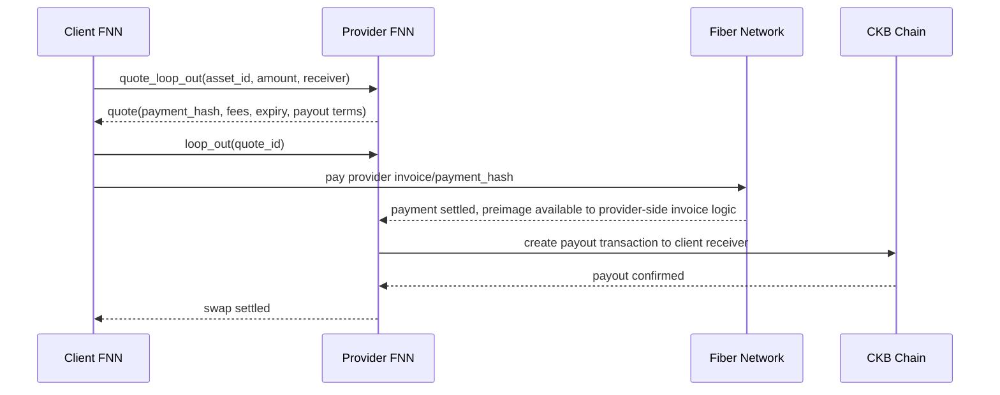
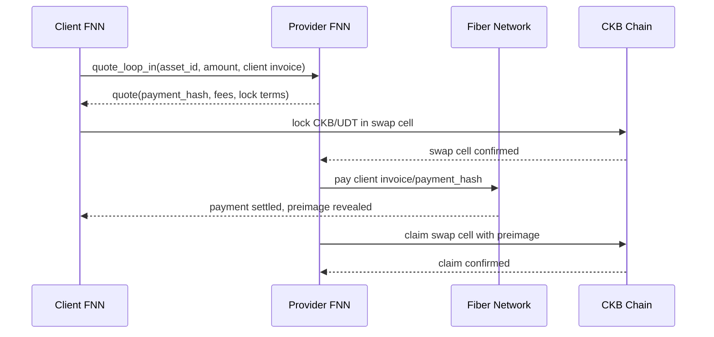
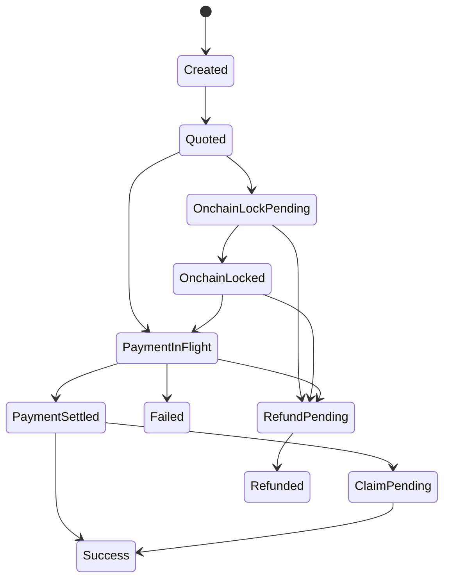

# Fiber Liquidity Management M0 Implementation Plan

> **For agentic workers:** REQUIRED SUB-SKILL: Use superpowers:subagent-driven-development (recommended) or superpowers:executing-plans to implement this plan task-by-task. Steps use checkbox (`- [ ]`) syntax for tracking.

**Goal:** Produce the M0 protocol and product specification for Fiber liquidity management so M1-M3 implementation plans can be written without unresolved protocol choices.

**Architecture:** This plan does not add runtime code. It creates a durable protocol spec that fixes the Loop In/Loop Out state machines, CKB+UDT asset model, on-chain swap primitive requirements, RPC contracts, persistence model, and p2p compatibility boundary.

**Tech Stack:** Markdown docs, Mermaid diagrams, existing Fiber docs conventions, GitHub issue #1541.

---

## File Structure

- Create: `docs/specs/liquidity-management.md`
  - Main M0 protocol spec that future implementation plans and PRs reference.
- Modify: `docs/superpowers/specs/2026-07-07-fiber-liquidity-management-design.md`
  - Add a link to the canonical protocol spec once it exists.
- Modify: GitHub issue `#1541`
  - Add a comment linking the canonical protocol spec path and summarizing M0 completion.

## Task 1: Create The Protocol Spec Skeleton

**Files:**
- Create: `docs/specs/liquidity-management.md`

- [ ] **Step 1: Create the spec with fixed section headings**

Use `apply_patch` to create `docs/specs/liquidity-management.md` with this content:

```markdown
# Fiber Liquidity Management Protocol

## Status

Draft for M0 protocol review.

## Scope

This protocol defines Loop In and Loop Out style liquidity swaps between Fiber
channels and CKB on-chain assets. It supports CKB and provider-whitelisted UDTs.
Swap negotiation uses RPC in the first product milestones. Fiber p2p messages are
not changed by this protocol version.

## Roles

- Client FNN: requests a liquidity swap.
- Provider FNN: optionally enabled role that quotes and fulfills swaps.
- Fiber network: routes ordinary payments.
- CKB chain: hosts on-chain swap cells for CKB or UDT assets.

## Asset Registry

## Quote Model

## Loop Out Protocol

## Loop In Protocol

## On-Chain Swap Cell Requirements

## Swap Order State Machine

## Persistence And Recovery

## RPC Contract

## P2P Compatibility

## Security Invariants

## M1 Implementation Inputs
```

- [ ] **Step 2: Verify the file exists and has all sections**

Run: `test -f docs/specs/liquidity-management.md && rg "^## " docs/specs/liquidity-management.md`

Expected output includes these headings exactly:

```text
## Status
## Scope
## Roles
## Asset Registry
## Quote Model
## Loop Out Protocol
## Loop In Protocol
## On-Chain Swap Cell Requirements
## Swap Order State Machine
## Persistence And Recovery
## RPC Contract
## P2P Compatibility
## Security Invariants
## M1 Implementation Inputs
```

- [ ] **Step 3: Commit the skeleton**

```bash
git add docs/specs/liquidity-management.md
git commit -m "docs: add liquidity management protocol skeleton"
```

## Task 2: Define Asset Registry And Quote Model

**Files:**
- Modify: `docs/specs/liquidity-management.md`

- [ ] **Step 1: Fill in `Asset Registry` and `Quote Model`**

Replace the empty `## Asset Registry` and `## Quote Model` sections with this text:

```markdown
## Asset Registry

Providers maintain a local asset registry. A swap request must reference an
asset by `asset_id`; the client must not provide an arbitrary UDT type script in
the execution request.

Asset entries have these fields:

| Field | Type | Meaning |
| --- | --- | --- |
| `asset_id` | string | Stable provider-local identifier used by quote and swap RPCs. |
| `kind` | `ckb` or `udt` | Asset family. |
| `udt_type_script` | nullable CKB script | Required when `kind = udt`; absent when `kind = ckb`. |
| `min_amount` | u128 decimal string | Smallest raw swap amount accepted by the provider. |
| `max_amount` | u128 decimal string | Largest raw swap amount accepted by the provider. |
| `available_capacity` | u128 decimal string | Provider-advertised capacity for this asset. |
| `base_fee` | u128 decimal string | Fixed provider fee charged in the swapped asset. |
| `proportional_fee_ppm` | u64 | Proportional provider fee in parts per million. |
| `enabled` | bool | Whether the provider currently quotes this asset. |

CKB amounts are raw shannons. UDT amounts are raw token units. Decimals and
display symbols are wallet/UI metadata and are not interpreted by this protocol.

For UDT swaps, CKB is still required for cell capacity and transaction fees. A
provider may reject a UDT quote if the client cannot satisfy the CKB capacity and
fee requirements.

## Quote Model

A quote is a provider commitment to execute a swap under fixed terms until
`expires_at`.

Common quote fields:

| Field | Type | Meaning |
| --- | --- | --- |
| `quote_id` | Hash256 hex | Provider-generated identifier. |
| `swap_kind` | `loop_in` or `loop_out` | Direction requested by the client. |
| `asset_id` | string | Asset registry identifier. |
| `amount` | u128 decimal string | Raw amount the client wants to swap before provider fee. |
| `provider_fee` | u128 decimal string | Fee charged in the swapped asset. |
| `routing_fee_limit` | u128 decimal string | Maximum Fiber routing fee in the swapped asset. |
| `onchain_fee_estimate_ckb` | u64 decimal string | Estimated CKB transaction fee. |
| `capacity_requirement_ckb` | u64 decimal string | CKB capacity required for CKB or UDT cells. |
| `payment_hash` | Hash256 hex | Hash used by the Fiber payment and on-chain claim path. |
| `expires_at` | u64 milliseconds | Quote expiry time. |
| `refund_after_lock_time` | u64 | Chain lock time after which refund is valid. |

Quote validation rules:

- `asset_id` must exist and be enabled in the provider registry.
- `amount` must be between `min_amount` and `max_amount`.
- `amount + provider_fee + routing_fee_limit` must fit in u128.
- `expires_at` must be later than the current node time.
- For UDT assets, the quote must include the registry's exact `udt_type_script`.
- The provider must reserve quoted capacity until the quote expires or the swap
  reaches a terminal state.
```

- [ ] **Step 2: Verify the asset and quote fields are searchable**

Run: `rg "asset_id|provider_fee|capacity_requirement_ckb|udt_type_script" docs/specs/liquidity-management.md`

Expected: each searched field appears in `docs/specs/liquidity-management.md`.

- [ ] **Step 3: Commit asset and quote model**

```bash
git add docs/specs/liquidity-management.md
git commit -m "docs: define liquidity asset and quote models"
```

## Task 3: Define Loop Out And Loop In Protocols

**Files:**
- Modify: `docs/specs/liquidity-management.md`

- [ ] **Step 1: Fill in `Loop Out Protocol` and `Loop In Protocol`**

Replace the empty sections with this text:

```markdown
## Loop Out Protocol

Loop Out moves Fiber channel balance to an on-chain CKB address or UDT receiver.

Sequence:



Safety rules:

- The provider must not broadcast the on-chain payout before the Fiber payment is
  settled or otherwise irreversibly claimable under the agreed hashlock flow.
- The client must not treat Loop Out as settled until the payout transaction is
  confirmed under the quote's confirmation policy.
- If the Fiber payment fails before settlement, both sides mark the swap failed
  and release reserved capacity.
- If the provider payment path settles but the payout transaction is not
  confirmed before the payout deadline, recovery must continue after restart and
  surface the order as non-terminal.

## Loop In Protocol

Loop In moves on-chain CKB or UDT into Fiber channel balance.

Sequence:



Safety rules:

- The provider must not send the Fiber payment until the on-chain swap cell is
  confirmed under the quote's confirmation policy.
- The client must be able to refund the on-chain swap cell after
  `refund_after_lock_time` if the Fiber payment does not settle.
- The provider must only claim with a preimage whose hash matches `payment_hash`.
- Both sides must persist the swap before broadcasting any Fiber payment or CKB
  transaction.
```

- [ ] **Step 2: Verify Mermaid blocks are present**

Run: `rg "sequenceDiagram|quote_loop_out|quote_loop_in|refund_after_lock_time" docs/specs/liquidity-management.md`

Expected: all terms are found.

- [ ] **Step 3: Commit protocol flows**

```bash
git add docs/specs/liquidity-management.md
git commit -m "docs: define liquidity swap flows"
```

## Task 4: Define On-Chain Swap Cell Requirements

**Files:**
- Modify: `docs/specs/liquidity-management.md`

- [ ] **Step 1: Fill in `On-Chain Swap Cell Requirements`**

Replace the empty section with this text:

```markdown
## On-Chain Swap Cell Requirements

The M1 implementation must choose a concrete CKB script design that satisfies
the requirements in this section. The CKB contract/script implementation lives
in the sibling `../fiber-scripts` repository. This repo consumes that script via
Fiber-side types, config, transaction builders, chain watchers, and integration
tests.

Common requirements:

- Claim path: spender provides a preimage whose hash equals `payment_hash`.
- Refund path: original funder can spend after `refund_after_lock_time`.
- The lock must bind the intended claimant and refund identity.
- The transaction builder must reject cells whose asset does not match the quote.
- The watcher must detect lock, claim, refund, and expiry-relevant blocks.

CKB swap requirements:

- The swapped value is represented by cell capacity in shannons.
- The cell must reserve enough capacity to remain valid after claim or refund.
- The claim and refund builders must keep fee calculation separate from the raw
  swapped amount reported in the quote.

UDT swap requirements:

- The cell must use the exact `udt_type_script` from the provider asset registry.
- The UDT amount in cell data must equal the quote's raw amount after applying
  the direction-specific fee rule.
- The CKB capacity in the UDT cell is operational capacity, not swapped value.
- Claim and refund outputs must preserve the UDT type script and amount.

M1 test vectors must cover:

- Correct preimage claim succeeds.
- Wrong preimage claim fails.
- Early refund fails.
- Refund after lock time succeeds.
- UDT type script mismatch is rejected.
- UDT amount mismatch is rejected.
- CKB amount below quote is rejected.
```

- [ ] **Step 2: Verify required test vectors are listed**

Run: `rg "Wrong preimage|Early refund|UDT type script mismatch|CKB amount below quote" docs/specs/liquidity-management.md`

Expected: all four phrases are found.

- [ ] **Step 3: Commit on-chain requirements**

```bash
git add docs/specs/liquidity-management.md
git commit -m "docs: define liquidity swap cell requirements"
```

## Task 5: Define Swap State Machine And Recovery

**Files:**
- Modify: `docs/specs/liquidity-management.md`

- [ ] **Step 1: Fill in `Swap Order State Machine` and `Persistence And Recovery`**

Replace the empty sections with this text:

```markdown
## Swap Order State Machine

Shared states:

| State | Meaning |
| --- | --- |
| `Created` | Local order record exists before external side effects. |
| `Quoted` | Provider quote is accepted and capacity is reserved. |
| `OnchainLockPending` | A required on-chain lock or payout transaction is broadcast but not confirmed. |
| `OnchainLocked` | Required on-chain lock is confirmed. |
| `PaymentInFlight` | Fiber payment has been sent and is waiting for result. |
| `PaymentSettled` | Fiber payment settled and a valid preimage is known where required. |
| `ClaimPending` | Claim transaction is broadcast but not confirmed. |
| `RefundPending` | Refund transaction is broadcast but not confirmed. |
| `Success` | Swap completed successfully. |
| `Failed` | Swap failed before funds were locked in a way that requires refund. |
| `Refunded` | Swap failed and locked funds were returned through refund. |

Terminal states are `Success`, `Failed`, and `Refunded`.

Allowed transitions:



Every transition must record `updated_at` and an event reason. Invalid backward
transitions must be rejected during normal execution and recovery.

## Persistence And Recovery

Before any external side effect, the node must persist the order state that
explains the next side effect.

Persisted fields:

| Field | Meaning |
| --- | --- |
| `swap_id` | Local unique identifier. |
| `quote_id` | Provider quote identifier. |
| `role` | `client` or `provider`. |
| `swap_kind` | `loop_in` or `loop_out`. |
| `asset_id` | Asset registry identifier. |
| `amount` | Raw swapped asset amount. |
| `payment_hash` | Hash used by Fiber payment and claim path. |
| `payment_preimage` | Known after settlement or claim observation. |
| `state` | Current state-machine state. |
| `onchain_outpoint` | Swap, payout, claim, or refund outpoint when known. |
| `refund_after_lock_time` | Lock time that enables refund. |
| `expires_at` | Quote or order expiry. |
| `created_at` | Creation timestamp in milliseconds. |
| `updated_at` | Last state change timestamp in milliseconds. |
| `failure_reason` | Human-readable terminal failure reason. |

Startup recovery rules:

- Terminal orders are not retried.
- `OnchainLockPending`, `ClaimPending`, and `RefundPending` resume chain watching.
- `OnchainLocked` resumes the next Fiber payment or refund eligibility check.
- `PaymentInFlight` reloads payment status from the payment store before retrying.
- Refund is attempted only after `refund_after_lock_time` is reached.
- Recovery must be idempotent when the same transaction was already broadcast.
```

- [ ] **Step 2: Verify state names and recovery rules are present**

Run: `rg "PaymentInFlight|Refunded|Startup recovery rules|idempotent" docs/specs/liquidity-management.md`

Expected: all terms are found.

- [ ] **Step 3: Commit state machine and recovery**

```bash
git add docs/specs/liquidity-management.md
git commit -m "docs: define liquidity swap state machine"
```

## Task 6: Define RPC Contract And P2P Boundary

**Files:**
- Modify: `docs/specs/liquidity-management.md`

- [ ] **Step 1: Fill in `RPC Contract` and `P2P Compatibility`**

Replace the empty sections with this text:

```markdown
## RPC Contract

Initial client RPCs:

### `quote_loop_out`

Request fields: `provider`, `asset_id`, `amount`, `receiver`, `max_provider_fee`,
`max_routing_fee`, `expires_after_seconds`.

Response fields: quote fields from the Quote Model plus provider routing details.

### `loop_out`

Request fields: `quote_id`, `max_provider_fee`, `max_routing_fee`.

Response fields: `swap_id`, `state`, `payment_hash`, `created_at`.

### `quote_loop_in`

Request fields: `provider`, `asset_id`, `amount`, `client_invoice`,
`max_provider_fee`, `max_routing_fee`, `expires_after_seconds`.

Response fields: quote fields from the Quote Model plus on-chain lock terms.

### `loop_in`

Request fields: `quote_id`, `funding_tx` or wallet funding parameters.

Response fields: `swap_id`, `state`, `payment_hash`, `created_at`.

### `get_swap`

Request fields: `swap_id`.

Response fields: persisted swap order fields.

### `list_swaps`

Request fields: optional `state`, optional `asset_id`, optional `limit`, optional
`cursor`.

Response fields: `swaps`, optional `next_cursor`.

Provider administration RPCs:

- `list_liquidity_assets`
- `add_liquidity_asset`
- `update_liquidity_asset`
- `disable_liquidity_asset`
- `get_liquidity_provider_status`

Biscuit permissions:

- Swap history reads require `read("liquidity")`.
- Client swap execution requires `write("liquidity")`.
- Provider asset and risk configuration requires `write("liquidity_provider")`.

## P2P Compatibility

This protocol version does not add Fiber p2p messages. Quote negotiation uses
RPC between client and provider FNNs. Fiber p2p only sees ordinary payments and
TLC forwarding.

Future multi-provider market work may add provider discovery, quote gossip,
capacity advertisement, liquidity feature bits, and anti-spam rules. Those
messages are outside M0-M8 and must not block the first manual Loop Out product.
```

- [ ] **Step 2: Verify RPC names are present**

Run: `rg "quote_loop_out|loop_out|quote_loop_in|loop_in|list_liquidity_assets|liquidity_provider" docs/specs/liquidity-management.md`

Expected: all RPC names and permission terms are found.

- [ ] **Step 3: Commit RPC and p2p boundary**

```bash
git add docs/specs/liquidity-management.md
git commit -m "docs: define liquidity RPC boundary"
```

## Task 7: Define Security Invariants And M1 Inputs

**Files:**
- Modify: `docs/specs/liquidity-management.md`

- [ ] **Step 1: Fill in `Security Invariants` and `M1 Implementation Inputs`**

Replace the empty sections with this text:

```markdown
## Security Invariants

- A provider cannot claim a client's on-chain Loop In funds without revealing the
  preimage that settles the client's Fiber invoice.
- A client cannot receive a Loop In Fiber payment and prevent a provider from
  claiming the corresponding on-chain swap cell before refund expiry.
- A provider cannot complete Loop Out by receiving Fiber funds without either
  completing the on-chain payout or leaving a recoverable non-terminal order.
- A client cannot execute a swap for a UDT outside the provider whitelist.
- Chain fees and CKB capacity are accounted separately from the swapped asset.
- Restart recovery never creates a second economic claim for the same order.
- Fiber p2p routers do not need to understand liquidity swaps.

## M1 Implementation Inputs

M1 may start when this spec has maintainer approval for:

- Asset registry field names and validation rules.
- Quote field names and fee semantics.
- Loop In and Loop Out sequence diagrams.
- On-chain swap cell requirements.
- State names and allowed transitions.
- Persistence fields and recovery rules.
- RPC method names and permission categories.
- No-p2p-change boundary for M0-M8.
- Cross-repo boundary: CKB scripts in `../fiber-scripts`, Fiber integration in
  this repository.

The M1 plan should be split into two coordinated workstreams. In `../fiber-scripts`,
it should add the CKB script contract and script-level tests. In this repository,
it should create Rust types in `crates/fiber-types/src/liquidity.rs`, JSON-RPC
types in `crates/fiber-json-types/src/liquidity.rs`, a new
`crates/fiber-lib/src/liquidity/` module, storage traits under the same module,
transaction builders that consume the script artifacts, and integration tests.
M1 must start with tests for asset validation, state transitions, and script test
vectors before adding transaction builders.
```

- [ ] **Step 2: Verify security invariants are explicit**

Run: `rg "provider cannot claim|client cannot receive|outside the provider whitelist|No-p2p-change" docs/specs/liquidity-management.md`

Expected: all searched invariant phrases are found.

- [ ] **Step 3: Commit security invariants**

```bash
git add docs/specs/liquidity-management.md
git commit -m "docs: define liquidity security invariants"
```

## Task 8: Link The Canonical Spec From The Design Doc

**Files:**
- Modify: `docs/superpowers/specs/2026-07-07-fiber-liquidity-management-design.md`

- [ ] **Step 1: Add a canonical spec link near the summary**

Use `apply_patch` to insert this paragraph after the summary section's first paragraph:

```markdown
The canonical M0 protocol spec lives at
[`docs/specs/liquidity-management.md`](../../specs/liquidity-management.md).
This design document records the milestone decomposition and earlier design
conversation; implementation planning should use the canonical protocol spec
once M0 is approved.
```

- [ ] **Step 2: Verify the link resolves as text**

Run: `rg "docs/specs/liquidity-management.md|canonical M0 protocol spec" docs/superpowers/specs/2026-07-07-fiber-liquidity-management-design.md`

Expected: both phrases are found.

- [ ] **Step 3: Commit the design-doc link**

```bash
git add docs/superpowers/specs/2026-07-07-fiber-liquidity-management-design.md
git commit -m "docs: link liquidity protocol spec from design"
```

## Task 9: Review The M0 Spec Against The Design Issue

**Files:**
- Read: `docs/specs/liquidity-management.md`
- Read: `docs/superpowers/specs/2026-07-07-fiber-liquidity-management-design.md`
- Update: GitHub issue `#1541`

- [ ] **Step 1: Check for incomplete-marker language**

Run: `rg -i "tb[d]|to[[:space:]]?do|fix[[:space:]]?me|place[[:space:]]?holder|implement[[:space:]]later|appropriate[[:space:]]error[[:space:]]handling|write[[:space:]]tests[[:space:]]for" docs/specs/liquidity-management.md docs/superpowers/specs/2026-07-07-fiber-liquidity-management-design.md`

Expected: no matches.

- [ ] **Step 2: Check spec coverage against the issue summary**

Run: `rg "CKB|UDT|whitelist|dual-role|provider mode|p2p|Loop Out|Loop In|state machine|recovery|Biscuit" docs/specs/liquidity-management.md`

Expected: each concept appears in the spec.

- [ ] **Step 3: Add an issue comment with the M0 review request**

Run this command:

```bash
gh issue comment 1541 --body '> *This was generated by AI during triage.*

M0 protocol spec draft is ready for maintainer review at `docs/specs/liquidity-management.md`.

Review focus:

- Asset registry and quote fields.
- Loop In / Loop Out sequence and safety rules.
- On-chain CKB + UDT swap cell requirements.
- Swap state machine and recovery rules.
- RPC method names and Biscuit permission split.
- Confirmation that M0-M8 do not require Fiber p2p changes.'
```

Expected: `gh` prints the created issue comment URL.

- [ ] **Step 4: Commit final M0 review state if any files changed**

Run: `git status --short`

If files are modified, commit them:

```bash
git add docs/specs/liquidity-management.md docs/superpowers/specs/2026-07-07-fiber-liquidity-management-design.md
git commit -m "docs: prepare liquidity protocol for review"
```

Expected after commit: `git status --short` does not show those two files as modified.

## Final Verification

- [ ] Run: `cargo fmt --all -- --check`
  - Expected: formatting check passes or reports no Rust files changed by this plan.
- [ ] Run: `rg -i "tb[d]|to[[:space:]]?do|fix[[:space:]]?me|place[[:space:]]?holder" docs/specs/liquidity-management.md docs/superpowers/specs/2026-07-07-fiber-liquidity-management-design.md`
  - Expected: no matches.
- [ ] Run: `git log --oneline -5`
  - Expected: recent commits show the M0 documentation commits.
